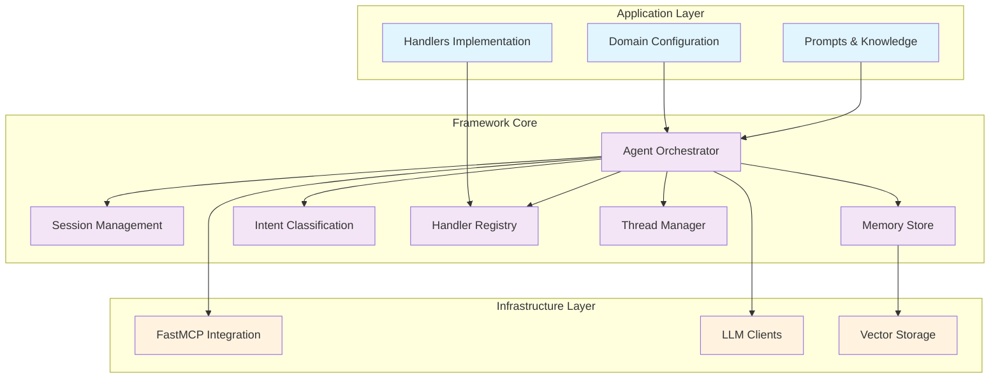

# AgentFlow Framework Specification

## Overview

AgentFlow is a reusable framework for building agentic applications with async workflows, per-user isolation, conversation threading, and pluggable domain logic. It abstracts the common patterns found in AI agent systems while allowing complete customization of domain-specific behavior.

## Framework Architecture

### Core Principle: Separation of Concerns



## Framework Core Components

### 1. Agent Orchestrator (Framework Core)

```python
from abc import ABC, abstractmethod
from typing import Dict, Any, Optional, List
import asyncio
from datetime import datetime

class AgentConfig:
    """Configuration container for agent behavior"""
    def __init__(self, config_dict: dict):
        self.intent_categories = config_dict.get('intent_categories', [])
        self.confidence_thresholds = config_dict.get('confidence_thresholds', {})
        self.session_config = config_dict.get('session_config', {})
        self.memory_config = config_dict.get('memory_config', {})
        self.tools_config = config_dict.get('tools_config', {})
        self.prompts = config_dict.get('prompts', {})

class AgentOrchestrator:
    """Core framework orchestrator - domain agnostic"""
    
    def __init__(
        self, 
        config: AgentConfig,
        intent_classifier: 'IntentClassifier',
        handler_registry: 'HandlerRegistry',
        memory_store: 'MemoryStore',
        session_manager: 'SessionManager',
        thread_manager: 'ThreadManager',
        confidence_evaluator: 'ConfidenceEvaluator',
        tool_manager: 'ToolManager'
    ):
        self.config = config
        self.intent_classifier = intent_classifier
        self.handler_registry = handler_registry
        self.memory_store = memory_store
        self.session_manager = session_manager
        self.thread_manager = thread_manager
        self.confidence_evaluator = confidence_evaluator
        self.tool_manager = tool_manager
        
    async def process_message(
        self, 
        user_id: str, 
        message: str, 
        context: Optional[dict] = None
    ) -> dict:
        """Main processing pipeline - framework orchestration"""
        
        # 1. Session Management
        session = await self.session_manager.get_or_create_session(user_id)
        
        # 2. Intent Classification
        intent = await self.intent_classifier.classify(
            message, session.conversation_history, context
        )
        
        # 3. Thread Management
        active_thread, new_thread_created = await self.thread_manager.process_message_with_thread_detection(
            session, message, intent
        )
        
        # 4. Context Gathering
        processing_context = await self._gather_context(
            intent, session, active_thread, context
        )
        
        # 5. Handler Routing
        response = await self.handler_registry.route_and_handle(
            intent, processing_context, session, active_thread
        )
        
        # 6. Confidence Evaluation
        confidence_result = await self.confidence_evaluator.evaluate(
            response, processing_context, intent
        )
        
        # 7. Response Finalization
        final_response = await self._finalize_response(
            response, confidence_result, session, active_thread
        )
        
        # 8. State Updates
        await self._update_state(session, active_thread, final_response, intent)
        
        return final_response
    
    async def _gather_context(
        self, 
        intent: dict, 
        session: 'Session', 
        thread: Optional['ConversationThread'],
        external_context: Optional[dict]
    ) -> dict:
        """Gather context from multiple sources"""
        
        context_tasks = []
        
        # User-specific memory
        context_tasks.append(
            self.memory_store.get_user_context(session.user_id)
        )
        
        # Thread-specific context
        if thread:
            context_tasks.append(
                self.memory_store.get_thread_context(thread.thread_id, session.user_id)
            )
        
        # Similar cases
        context_tasks.append(
            self.memory_store.retrieve_similar_cases(
                intent.get('query', ''), session.user_id
            )
        )
        
        # Run context gathering in parallel
        results = await asyncio.gather(*context_tasks, return_exceptions=True)
        
        return {
            'user_context': results[0] if len(results) > 0 and not isinstance(results[0], Exception) else {},
            'thread_context': results[1] if len(results) > 1 and not isinstance(results[1], Exception) else {},
            'similar_cases': results[2] if len(results) > 2 and not isinstance(results[2], Exception) else [],
            'intent': intent,
            'session_info': {
                'user_id': session.user_id,
                'session_duration': (datetime.now() - session.created_at).total_seconds(),
                'message_count': len(session.conversation_history)
            },
            'external_context': external_context or {}
        }
    
    async def _finalize_response(
        self, 
        response: dict, 
        confidence_result: dict, 
        session: 'Session',
        thread: Optional['ConversationThread']
    ) -> dict:
        """Finalize response with metadata"""
        
        return {
            'content': response.get('content', ''),
            'metadata': {
                'confidence_score': confidence_result.get('confidence', 0.0),
                'should_escalate': confidence_result.get('should_escalate', False),
                'processing_time': response.get('processing_time', 0),
                'user_id': session.user_id,
                'thread_id': thread.thread_id if thread else None,
                'intent_type': response.get('intent_type'),
                'tools_used': response.get('tools_used', []),
                'timestamp': datetime.now().isoformat()
            },
            'escalation_info': confidence_result.get('escalation_context') if confidence_result.get('should_escalate') else None,
            'suggested_actions': response.get('suggested_actions', []),
            'confidence_breakdown': confidence_result.get('components', {})
        }
    
    async def _update_state(
        self, 
        session: 'Session', 
        thread: Optional['ConversationThread'],
        response: dict, 
        intent: dict
    ):
        """Update session and memory state"""
        
        # Update conversation history
        session.conversation_history.append({
            'message': intent.get('original_message'),
            'response': response['content'],
            'timestamp': datetime.now().isoformat(),
            'intent': intent,
            'confidence': response['metadata']['confidence_score']
        })
        
        # Save session
        await self.session_manager.save_session(session)
        
        # Update memory if response was successful
        if response['metadata']['confidence_score'] > 0.5:
            await self.memory_store.add_successful_interaction(
                session.user_id,
                intent,
                response,
                thread.thread_id if thread else None
            )
```

### 2. Intent Classification (Pluggable)

```python
class IntentCategory:
    """Represents a single intent category"""
    def __init__(self, name: str, description: str, examples: List[str], confidence_threshold: float = 0.5):
        self.name = name
        self.description = description
        self.examples = examples
        self.confidence_threshold = confidence_threshold
        self.keywords = []
        self.patterns = []

class IntentClassifier:
    """Generic intent classifier with pluggable categories"""
    
    def __init__(self, llm_client, categories: List[IntentCategory], system_prompt_template: str):
        self.llm_client = llm_client
        self.categories = {cat.name: cat for cat in categories}
        self.system_prompt_template = system_prompt_template
        
    async def classify(self, message: str, history: List[dict], context: Optional[dict] = None) -> dict:
        """Classify message intent using configured categories"""
        
        # Build dynamic prompt with categories
        categories_description = self._build_categories_description()
        prompt = self.system_prompt_template.format(
            categories=categories_description,
            message=message,
            history=self._format_history(history[-3:]),  # Last 3 messages
            context=context or {}
        )
        
        try:
            result = await self.llm_client.agenerate(prompt)
            return self._parse_classification_result(result, message)
        except Exception as e:
            return self._fallback_classification(message, e)
    
    def _build_categories_description(self) -> str:
        """Build categories description for prompt"""
        descriptions = []
        for category in self.categories.values():
            desc = f"- {category.name.upper()}: {category.description}"
            if category.examples:
                desc += f"\n  Examples: {', '.join(category.examples[:3])}"
            descriptions.append(desc)
        return "\n".join(descriptions)
    
    def add_category(self, category: IntentCategory):
        """Add new intent category at runtime"""
        self.categories[category.name] = category
    
    def remove_category(self, category_name: str):
        """Remove intent category"""
        if category_name in self.categories:
            del self.categories[category_name]
```

### 3. Handler Registry (Pluggable)

```python
class BaseHandler(ABC):
    """Abstract base handler for framework"""
    
    @abstractmethod
    async def can_handle(self, intent: dict, context: dict) -> bool:
        """Determine if this handler can process the intent"""
        pass
        
    @abstractmethod
    async def handle(
        self, 
        message: str, 
        intent: dict,
        context: dict, 
        session: 'Session',
        thread: Optional['ConversationThread']
    ) -> dict:
        """Process the request"""
        pass
    
    @abstractmethod
    def get_priority(self) -> int:
        """Return handler priority (higher = more priority)"""
        pass

class HandlerRegistry:
    """Registry for pluggable handlers"""
    
    def __init__(self):
        self.handlers: List[BaseHandler] = []
        self._handler_cache: Dict[str, BaseHandler] = {}
    
    def register_handler(self, handler: BaseHandler):
        """Register a new handler"""
        self.handlers.append(handler)
        # Sort by priority (highest first)
        self.handlers.sort(key=lambda h: h.get_priority(), reverse=True)
        self._handler_cache.clear()  # Clear cache
    
    def unregister_handler(self, handler_class: type):
        """Unregister a handler by class"""
        self.handlers = [h for h in self.handlers if not isinstance(h, handler_class)]
        self._handler_cache.clear()
    
    async def route_and_handle(
        self, 
        intent: dict, 
        context: dict, 
        session: 'Session',
        thread: Optional['ConversationThread']
    ) -> dict:
        """Route to appropriate handler"""
        
        # Check cache first
        cache_key = intent.get('type', 'unknown')
        if cache_key in self._handler_cache:
            handler = self._handler_cache[cache_key]
            if await handler.can_handle(intent, context):
                return await handler.handle(
                    context['original_message'], intent, context, session, thread
                )
        
        # Find appropriate handler
        for handler in self.handlers:
            try:
                if await handler.can_handle(intent, context):
                    self._handler_cache[cache_key] = handler
                    return await handler.handle(
                        context['original_message'], intent, context, session, thread
                    )
            except Exception as e:
                # Log error and continue to next handler
                print(f"Handler {handler.__class__.__name__} failed: {e}")
                continue
        
        # No handler found
        return {
            'content': 'I apologize, but I cannot handle this type of request at the moment.',
            'error': 'no_handler_found',
            'intent_type': intent.get('type'),
            'fallback': True
        }

class GenericQueryHandler(BaseHandler):
    """Generic handler for simple query responses"""
    
    def __init__(self, knowledge_base, llm_client, tools_manager):
        self.knowledge_base = knowledge_base
        self.llm_client = llm_client
        self.tools = tools_manager
    
    async def can_handle(self, intent: dict, context: dict) -> bool:
        # Can handle any query-type intent as fallback
        return intent.get('type', '').lower() in ['query', 'question', 'general']
    
    def get_priority(self) -> int:
        return 1  # Low priority - fallback handler
    
    async def handle(self, message: str, intent: dict, context: dict, session, thread) -> dict:
        # Generic query handling logic
        knowledge_results = await self.knowledge_base.search(message)
        similar_cases = context.get('similar_cases', [])
        
        response = await self._generate_response(
            message, knowledge_results, similar_cases, context
        )
        
        return {
            'content': response,
            'intent_type': intent['type'],
            'tools_used': ['knowledge_base'],
            'processing_time': 0.5
        }
```

### 4. Configuration System

```python
class AgentFrameworkBuilder:
    """Builder for configuring and creating agent instances"""
    
    def __init__(self):
        self.config = {}
        self.intent_categories = []
        self.handlers = []
        self.prompts = {}
        self.tools = {}
    
    def with_intent_categories(self, categories: List[IntentCategory]) -> 'AgentFrameworkBuilder':
        """Configure intent categories"""
        self.intent_categories = categories
        return self
    
    def with_handlers(self, handlers: List[BaseHandler]) -> 'AgentFrameworkBuilder':
        """Configure handlers"""
        self.handlers = handlers
        return self
    
    def with_prompts(self, prompts: Dict[str, str]) -> 'AgentFrameworkBuilder':
        """Configure system prompts"""
        self.prompts = prompts
        return self
    
    def with_confidence_thresholds(self, thresholds: Dict[str, float]) -> 'AgentFrameworkBuilder':
        """Configure confidence thresholds per intent type"""
        self.config['confidence_thresholds'] = thresholds
        return self
    
    def with_session_config(self, ttl_seconds: int = 3600, cleanup_interval: int = 300) -> 'AgentFrameworkBuilder':
        """Configure session management"""
        self.config['session_config'] = {
            'ttl_seconds': ttl_seconds,
            'cleanup_interval': cleanup_interval
        }
        return self
    
    def with_memory_config(self, max_episodic_per_user: int = 100, similarity_threshold: float = 0.6) -> 'AgentFrameworkBuilder':
        """Configure memory management"""
        self.config['memory_config'] = {
            'max_episodic_per_user': max_episodic_per_user,
            'similarity_threshold': similarity_threshold
        }
        return self
    
    def with_tools(self, tool_configs: Dict[str, dict]) -> 'AgentFrameworkBuilder':
        """Configure tool integrations"""
        self.tools = tool_configs
        return self
    
    async def build(self, llm_client, fastmcp_client=None) -> AgentOrchestrator:
        """Build the configured agent"""
        
        # Create core components
        agent_config = AgentConfig({
            **self.config,
            'intent_categories': [cat.name for cat in self.intent_categories],
            'prompts': self.prompts,
            'tools_config': self.tools
        })
        
        # Initialize components
        intent_classifier = IntentClassifier(
            llm_client, 
            self.intent_categories,
            self.prompts.get('intent_classification', self._default_intent_prompt())
        )
        
        handler_registry = HandlerRegistry()
        for handler in self.handlers:
            handler_registry.register_handler(handler)
        
        memory_store = MemoryStore(self.config.get('memory_config', {}))
        session_manager = SessionManager(self.config.get('session_config', {}))
        thread_manager = ThreadManager(llm_client)
        confidence_evaluator = ConfidenceEvaluator(self.config.get('confidence_thresholds', {}))
        tool_manager = ToolManager(fastmcp_client, self.tools) if fastmcp_client else None
        
        return AgentOrchestrator(
            agent_config,
            intent_classifier,
            handler_registry,
            memory_store,
            session_manager,
            thread_manager,
            confidence_evaluator,
            tool_manager
        )
    
    def _default_intent_prompt(self) -> str:
        return """
        You are an expert at categorizing user messages.
        
        Analyze the message and classify it into one of these categories:
        {categories}
        
        Message: {message}
        Recent History: {history}
        Context: {context}
        
        Return JSON format:
        {{
          "type": "CATEGORY_NAME",
          "confidence": 0.95,
          "urgency": "high|medium|low",
          "reasoning": "Brief explanation"
        }}
        """
```

## Framework Usage Examples

### Example 1: Support Agent (Current Implementation)

```python
from agentflow import AgentFrameworkBuilder, IntentCategory, BaseHandler

# Define domain-specific intent categories
support_categories = [
    IntentCategory("QUERY", "General platform questions", ["How do I...", "What is..."]),
    IntentCategory("OUTAGE", "Production issues", ["Service is down", "Error in production"]),
    IntentCategory("DATA_ISSUE", "Data problems", ["Data quality issue", "Missing data"]),
    IntentCategory("REVIEW_REQUEST", "Code reviews", ["Please review this", "Can you check"]),
    IntentCategory("BLESS_REQUEST", "Approvals", ["Please approve", "Sign off needed"])
]

# Define domain-specific handlers
class SupportQueryHandler(BaseHandler):
    async def can_handle(self, intent: dict, context: dict) -> bool:
        return intent['type'] == 'QUERY'
    
    def get_priority(self) -> int:
        return 5
    
    async def handle(self, message, intent, context, session, thread) -> dict:
        # Support-specific query logic
        pass

class SupportOutageHandler(BaseHandler):
    async def can_handle(self, intent: dict, context: dict) -> bool:
        return intent['type'] == 'OUTAGE'
    
    def get_priority(self) -> int:
        return 10  # High priority for outages
    
    async def handle(self, message, intent, context, session, thread) -> dict:
        # Outage-specific logic
        pass

# Build the support agent
async def create_support_agent(llm_client, fastmcp_client):
    return await (AgentFrameworkBuilder()
        .with_intent_categories(support_categories)
        .with_handlers([
            SupportQueryHandler(),
            SupportOutageHandler(),
            # ... other handlers
        ])
        .with_confidence_thresholds({
            'QUERY': 0.5,
            'OUTAGE': 0.7,
            'DATA_ISSUE': 0.6,
            'REVIEW_REQUEST': 0.0,  # Always escalate
            'BLESS_REQUEST': 0.0
        })
        .with_prompts({
            'intent_classification': SUPPORT_INTENT_PROMPT,
            'query_response': SUPPORT_QUERY_PROMPT,
            'outage_response': SUPPORT_OUTAGE_PROMPT
        })
        .build(llm_client, fastmcp_client))
```

### Example 2: E-commerce Assistant

```python
# Different domain, same framework
ecommerce_categories = [
    IntentCategory("PRODUCT_INQUIRY", "Questions about products", ["What's the price of...", "Do you have..."]),
    IntentCategory("ORDER_STATUS", "Order tracking", ["Where is my order", "Order status"]),
    IntentCategory("RETURN_REQUEST", "Returns and refunds", ["I want to return", "Refund request"]),
    IntentCategory("RECOMMENDATION", "Product recommendations", ["What do you recommend", "Similar products"])
]

class ProductInquiryHandler(BaseHandler):
    def __init__(self, product_catalog):
        self.catalog = product_catalog
    
    async def can_handle(self, intent: dict, context: dict) -> bool:
        return intent['type'] == 'PRODUCT_INQUIRY'
    
    def get_priority(self) -> int:
        return 8
    
    async def handle(self, message, intent, context, session, thread) -> dict:
        # E-commerce specific product inquiry logic
        pass

# Build e-commerce agent with same framework
async def create_ecommerce_agent(llm_client):
    return await (AgentFrameworkBuilder()
        .with_intent_categories(ecommerce_categories)
        .with_handlers([
            ProductInquiryHandler(product_catalog),
            OrderStatusHandler(order_system),
            # ... other handlers
        ])
        .with_confidence_thresholds({
            'PRODUCT_INQUIRY': 0.6,
            'ORDER_STATUS': 0.8,
            'RETURN_REQUEST': 0.4,  # Lower threshold, escalate more
            'RECOMMENDATION': 0.5
        })
        .build(llm_client))
```

### Example 3: Personal Assistant

```python
# Personal productivity assistant
personal_categories = [
    IntentCategory("SCHEDULE", "Calendar management", ["Schedule a meeting", "What's my calendar"]),
    IntentCategory("REMINDER", "Set reminders", ["Remind me to", "Set a reminder"]),
    IntentCategory("EMAIL", "Email management", ["Check my email", "Send an email"]),
    IntentCategory("TASK", "Task management", ["Add to my todo", "What are my tasks"])
]

# Framework handles orchestration, we just define domain logic
class ScheduleHandler(BaseHandler):
    def __init__(self, calendar_service):
        self.calendar = calendar_service
    
    async def can_handle(self, intent: dict, context: dict) -> bool:
        return intent['type'] == 'SCHEDULE'
    
    def get_priority(self) -> int:
        return 7
    
    async def handle(self, message, intent, context, session, thread) -> dict:
        # Calendar-specific logic using calendar_service
        pass
```

## Advanced Framework Features

### 1. Plugin System & Component Discovery

```python
from typing import Protocol, runtime_checkable
import importlib
import pkgutil

@runtime_checkable
class AgentPlugin(Protocol):
    """Protocol for agent plugins"""
    
    def get_intent_categories(self) -> List[IntentCategory]:
        """Return intent categories provided by this plugin"""
        ...
    
    def get_handlers(self) -> List[BaseHandler]:
        """Return handlers provided by this plugin"""
        ...
    
    def get_prompts(self) -> Dict[str, str]:
        """Return prompt templates provided by this plugin"""
        ...
    
    def get_tools_config(self) -> Dict[str, dict]:
        """Return tool configurations provided by this plugin"""
        ...

class PluginManager:
    """Manages plugin discovery and loading"""
    
    def __init__(self):
        self.loaded_plugins: Dict[str, AgentPlugin] = {}
    
    def discover_plugins(self, package_name: str = "agentflow_plugins") -> List[str]:
        """Discover available plugins in a package"""
        try:
            package = importlib.import_module(package_name)
            plugins = []
            
            for importer, modname, ispkg in pkgutil.iter_modules(package.__path__, package.__name__ + "."):
                if not ispkg:
                    plugins.append(modname)
            
            return plugins
        except ImportError:
            return []
    
    def load_plugin(self, plugin_name: str) -> Optional[AgentPlugin]:
        """Load a specific plugin"""
        try:
            module = importlib.import_module(plugin_name)
            
            # Look for plugin class or create_plugin function
            if hasattr(module, 'create_plugin'):
                plugin = module.create_plugin()
            elif hasattr(module, 'Plugin'):
                plugin = module.Plugin()
            else:
                raise ValueError(f"Plugin {plugin_name} must have 'create_plugin()' function or 'Plugin' class")
            
            if isinstance(plugin, AgentPlugin):
                self.loaded_plugins[plugin_name] = plugin
                return plugin
            else:
                raise ValueError(f"Plugin {plugin_name} does not implement AgentPlugin protocol")
                
        except Exception as e:
            print(f"Failed to load plugin {plugin_name}: {e}")
            return None
    
    def get_all_intent_categories(self) -> List[IntentCategory]:
        """Get intent categories from all loaded plugins"""
        categories = []
        for plugin in self.loaded_plugins.values():
            categories.extend(plugin.get_intent_categories())
        return categories
    
    def get_all_handlers(self) -> List[BaseHandler]:
        """Get handlers from all loaded plugins"""
        handlers = []
        for plugin in self.loaded_plugins.values():
            handlers.extend(plugin.get_handlers())
        return handlers

# Enhanced builder with plugin support
class AgentFrameworkBuilder:
    """Enhanced builder with plugin support"""
    
    def __init__(self):
        self.config = {}
        self.intent_categories = []
        self.handlers = []
        self.prompts = {}
        self.tools = {}
        self.plugin_manager = PluginManager()
    
    def with_plugins(self, plugin_names: List[str]) -> 'AgentFrameworkBuilder':
        """Load and configure plugins"""
        for plugin_name in plugin_names:
            plugin = self.plugin_manager.load_plugin(plugin_name)
            if plugin:
                self.intent_categories.extend(plugin.get_intent_categories())
                self.handlers.extend(plugin.get_handlers())
                self.prompts.update(plugin.get_prompts())
                self.tools.update(plugin.get_tools_config())
        return self
    
    def auto_discover_plugins(self, package_name: str = "agentflow_plugins") -> 'AgentFrameworkBuilder':
        """Auto-discover and load all available plugins"""
        discovered = self.plugin_manager.discover_plugins(package_name)
        return self.with_plugins(discovered)
```

### 2. Configuration Validation & Schema

```python
from pydantic import BaseModel, validator
from typing import Optional, Union

class SessionConfig(BaseModel):
    ttl_seconds: int = 3600
    cleanup_interval: int = 300
    max_sessions_per_user: int = 1
    thread_inactivity_threshold: int = 30
    
    @validator('ttl_seconds')
    def ttl_must_be_positive(cls, v):
        if v <= 0:
            raise ValueError('TTL must be positive')
        return v

class MemoryConfig(BaseModel):
    max_episodic_per_user: int = 100
    similarity_threshold: float = 0.6
    vector_dimension: int = 768
    cleanup_threshold: int = 1000
    
    @validator('similarity_threshold')
    def similarity_in_range(cls, v):
        if not 0 <= v <= 1:
            raise ValueError('Similarity threshold must be between 0 and 1')
        return v

class ConfidenceConfig(BaseModel):
    default_threshold: float = 0.5
    intent_specific: Dict[str, float] = {}
    escalation_threshold: float = 0.3
    
    @validator('default_threshold', 'escalation_threshold')
    def thresholds_in_range(cls, v):
        if not 0 <= v <= 1:
            raise ValueError('Thresholds must be between 0 and 1')
        return v

class AgentFrameworkConfig(BaseModel):
    """Validated configuration schema"""
    name: str
    description: Optional[str] = None
    version: str = "1.0.0"
    
    session_config: SessionConfig = SessionConfig()
    memory_config: MemoryConfig = MemoryConfig()
    confidence_config: ConfidenceConfig = ConfidenceConfig()
    
    # LLM Configuration
    llm_config: Dict[str, Any] = {}
    
    # Tool Configuration
    tools_config: Dict[str, Dict[str, Any]] = {}
    
    # Domain-specific settings
    domain_settings: Dict[str, Any] = {}
    
    class Config:
        extra = "allow"  # Allow additional domain-specific fields

class ConfigLoader:
    """Loads and validates configuration from various sources"""
    
    @staticmethod
    def from_dict(config_dict: dict) -> AgentFrameworkConfig:
        """Load from dictionary"""
        return AgentFrameworkConfig(**config_dict)
    
    @staticmethod
    def from_yaml(yaml_path: str) -> AgentFrameworkConfig:
        """Load from YAML file"""
        import yaml
        with open(yaml_path, 'r') as f:
            config_dict = yaml.safe_load(f)
        return AgentFrameworkConfig(**config_dict)
    
    @staticmethod
    def from_json(json_path: str) -> AgentFrameworkConfig:
        """Load from JSON file"""
        import json
        with open(json_path, 'r') as f:
            config_dict = json.load(f)
        return AgentFrameworkConfig(**config_dict)
    
    @staticmethod
    def from_env(prefix: str = "AGENT_") -> AgentFrameworkConfig:
        """Load from environment variables"""
        import os
        config_dict = {}
        
        for key, value in os.environ.items():
            if key.startswith(prefix):
                config_key = key[len(prefix):].lower()
                # Convert strings to appropriate types
                if value.lower() in ('true', 'false'):
                    config_dict[config_key] = value.lower() == 'true'
                elif value.isdigit():
                    config_dict[config_key] = int(value)
                else:
                    try:
                        config_dict[config_key] = float(value)
                    except ValueError:
                        config_dict[config_key] = value
        
        return AgentFrameworkConfig(**config_dict)
```

### 3. Middleware System

```python
class Middleware(ABC):
    """Base class for middleware components"""
    
    @abstractmethod
    async def before_process(self, user_id: str, message: str, context: dict) -> tuple[str, dict]:
        """Called before message processing"""
        return message, context
    
    @abstractmethod
    async def after_process(self, user_id: str, response: dict, context: dict) -> dict:
        """Called after message processing"""
        return response
    
    @abstractmethod
    async def on_error(self, user_id: str, error: Exception, context: dict) -> Optional[dict]:
        """Called when an error occurs"""
        return None

class LoggingMiddleware(Middleware):
    """Logs all interactions"""
    
    async def before_process(self, user_id: str, message: str, context: dict) -> tuple[str, dict]:
        print(f"[{datetime.now()}] User {user_id}: {message}")
        return message, context
    
    async def after_process(self, user_id: str, response: dict, context: dict) -> dict:
        print(f"[{datetime.now()}] Response to {user_id}: {response.get('content', '')[:100]}...")
        return response
    
    async def on_error(self, user_id: str, error: Exception, context: dict) -> Optional[dict]:
        print(f"[{datetime.now()}] Error for {user_id}: {error}")
        return None

class RateLimitMiddleware(Middleware):
    """Rate limiting per user"""
    
    def __init__(self, max_requests_per_minute: int = 60):
        self.max_requests = max_requests_per_minute
        self.user_requests: Dict[str, List[datetime]] = defaultdict(list)
    
    async def before_process(self, user_id: str, message: str, context: dict) -> tuple[str, dict]:
        now = datetime.now()
        user_requests = self.user_requests[user_id]
        
        # Clean old requests
        cutoff = now - timedelta(minutes=1)
        user_requests[:] = [req_time for req_time in user_requests if req_time > cutoff]
        
        if len(user_requests) >= self.max_requests:
            raise ValueError(f"Rate limit exceeded for user {user_id}")
        
        user_requests.append(now)
        return message, context
    
    async def after_process(self, user_id: str, response: dict, context: dict) -> dict:
        return response
    
    async def on_error(self, user_id: str, error: Exception, context: dict) -> Optional[dict]:
        return None

class MiddlewareManager:
    """Manages middleware pipeline"""
    
    def __init__(self):
        self.middlewares: List[Middleware] = []
    
    def add_middleware(self, middleware: Middleware):
        """Add middleware to the pipeline"""
        self.middlewares.append(middleware)
    
    async def process_before(self, user_id: str, message: str, context: dict) -> tuple[str, dict]:
        """Run all before_process middlewares"""
        current_message, current_context = message, context
        
        for middleware in self.middlewares:
            try:
                current_message, current_context = await middleware.before_process(
                    user_id, current_message, current_context
                )
            except Exception as e:
                # Try error handling in middleware
                error_response = await middleware.on_error(user_id, e, current_context)
                if error_response:
                    raise Exception(f"Middleware error with response: {error_response}")
                else:
                    raise e
        
        return current_message, current_context
    
    async def process_after(self, user_id: str, response: dict, context: dict) -> dict:
        """Run all after_process middlewares"""
        current_response = response
        
        # Run in reverse order
        for middleware in reversed(self.middlewares):
            try:
                current_response = await middleware.after_process(
                    user_id, current_response, context
                )
            except Exception as e:
                error_response = await middleware.on_error(user_id, e, context)
                if error_response:
                    return error_response
                else:
                    raise e
        
        return current_response
```

### 4. Enhanced Builder with Full Configuration

```python
class AgentFrameworkBuilder:
    """Complete builder with all framework features"""
    
    def __init__(self):
        self.config = AgentFrameworkConfig(name="default_agent")
        self.intent_categories = []
        self.handlers = []
        self.prompts = {}
        self.tools = {}
        self.middlewares = []
        self.plugin_manager = PluginManager()
    
    def with_config(self, config: Union[AgentFrameworkConfig, dict, str]) -> 'AgentFrameworkBuilder':
        """Configure with validated config object or load from file"""
        if isinstance(config, str):
            # Assume it's a file path
            if config.endswith('.yaml') or config.endswith('.yml'):
                self.config = ConfigLoader.from_yaml(config)
            elif config.endswith('.json'):
                self.config = ConfigLoader.from_json(config)
            else:
                raise ValueError("Config file must be .yaml, .yml, or .json")
        elif isinstance(config, dict):
            self.config = ConfigLoader.from_dict(config)
        else:
            self.config = config
        return self
    
    def with_middleware(self, middleware: Middleware) -> 'AgentFrameworkBuilder':
        """Add middleware to the pipeline"""
        self.middlewares.append(middleware)
        return self
    
    def with_rate_limiting(self, max_requests_per_minute: int = 60) -> 'AgentFrameworkBuilder':
        """Add rate limiting middleware"""
        return self.with_middleware(RateLimitMiddleware(max_requests_per_minute))
    
    def with_logging(self) -> 'AgentFrameworkBuilder':
        """Add logging middleware"""
        return self.with_middleware(LoggingMiddleware())
    
    def with_custom_validator(self, validator_func) -> 'AgentFrameworkBuilder':
        """Add custom configuration validator"""
        # Validate current config
        validator_func(self.config)
        return self
    
    async def build(self, llm_client, fastmcp_client=None) -> AgentOrchestrator:
        """Build the configured agent with full feature set"""
        
        # Create middleware manager
        middleware_manager = MiddlewareManager()
        for middleware in self.middlewares:
            middleware_manager.add_middleware(middleware)
        
        # Create core components with enhanced configuration
        intent_classifier = IntentClassifier(
            llm_client, 
            self.intent_categories,
            self.prompts.get('intent_classification', self._default_intent_prompt())
        )
        
        handler_registry = HandlerRegistry()
        for handler in self.handlers:
            handler_registry.register_handler(handler)
        
        memory_store = MemoryStore(self.config.memory_config.dict())
        session_manager = SessionManager(self.config.session_config.dict())
        thread_manager = ThreadManager(llm_client)
        confidence_evaluator = ConfidenceEvaluator(self.config.confidence_config.dict())
        tool_manager = ToolManager(fastmcp_client, self.tools) if fastmcp_client else None
        
        # Create enhanced orchestrator
        orchestrator = AgentOrchestrator(
            self.config,
            intent_classifier,
            handler_registry,
            memory_store,
            session_manager,
            thread_manager,
            confidence_evaluator,
            tool_manager
        )
        
        # Add middleware
        orchestrator.middleware_manager = middleware_manager
        
        return orchestrator
```

## Framework Benefits

1. **Reusable Core**: Session management, threading, memory, orchestration
2. **Domain Flexibility**: Easy to configure for any agentic application  
3. **Pluggable Components**: Handlers, intents, prompts, tools, middleware are all configurable
4. **Plugin System**: Dynamic discovery and loading of domain extensions
5. **Configuration Management**: Type-safe configuration with validation
6. **Middleware Pipeline**: Cross-cutting concerns like logging, rate limiting, authentication
7. **Consistent Patterns**: Same architecture across different domains
8. **Built-in Best Practices**: User isolation, async processing, confidence evaluation
9. **Tool Integration**: FastMCP integration baked into framework
10. **Production Ready**: Error handling, monitoring, scalability built-in

The framework provides the "plumbing" while allowing complete customization of the "business logic" for each domain. It's designed to be the foundation for any conversational AI agent system.

## Configuration Examples

### 1. Support Agent Configuration (YAML)

```yaml
# support_agent_config.yaml
name: "support_agent"
description: "Technical support assistant"
version: "1.0.0"

session_config:
  ttl_seconds: 3600
  cleanup_interval: 300
  max_sessions_per_user: 1
  thread_inactivity_threshold: 30

memory_config:
  max_episodic_per_user: 100
  similarity_threshold: 0.6
  vector_dimension: 768

confidence_config:
  default_threshold: 0.5
  intent_specific:
    QUERY: 0.5
    OUTAGE: 0.7
    DATA_ISSUE: 0.6
    REVIEW_REQUEST: 0.0  # Always escalate
    BLESS_REQUEST: 0.0   # Always escalate
  escalation_threshold: 0.3

llm_config:
  provider: "anthropic"
  model: "claude-3-sonnet"
  temperature: 0.1
  max_tokens: 2000

tools_config:
  knowledge_base:
    type: "vector_search"
    config:
      index_name: "support_kb"
      max_results: 10
  log_analyzer:
    type: "fastmcp_tool"
    config:
      tool_name: "log_analyzer"
      timeout: 30
  escalation_router:
    type: "fastmcp_tool"
    config:
      tool_name: "escalation_router"

domain_settings:
  support_channels: ["slack", "email", "web"]
  escalation_teams:
    - name: "tier2_support"
      specialties: ["outage", "data_issue"]
    - name: "engineering"
      specialties: ["review_request", "bless_request"]
  sla_targets:
    QUERY: 300  # 5 minutes
    OUTAGE: 60  # 1 minute
    DATA_ISSUE: 900  # 15 minutes
```

### 2. E-commerce Assistant Configuration (JSON)

```json
{
  "name": "ecommerce_assistant",
  "description": "Shopping and order management assistant",
  "version": "2.1.0",
  "session_config": {
    "ttl_seconds": 7200,
    "cleanup_interval": 600,
    "max_sessions_per_user": 3,
    "thread_inactivity_threshold": 45
  },
  "memory_config": {
    "max_episodic_per_user": 200,
    "similarity_threshold": 0.7,
    "vector_dimension": 1024
  },
  "confidence_config": {
    "default_threshold": 0.6,
    "intent_specific": {
      "PRODUCT_INQUIRY": 0.6,
      "ORDER_STATUS": 0.8,
      "RETURN_REQUEST": 0.4,
      "RECOMMENDATION": 0.5
    },
    "escalation_threshold": 0.4
  },
  "tools_config": {
    "product_catalog": {
      "type": "database",
      "config": {
        "connection_string": "postgresql://...",
        "search_limit": 20
      }
    },
    "order_system": {
      "type": "api",
      "config": {
        "base_url": "https://api.orders.com",
        "auth_header": "X-API-Key"
      }
    }
  },
  "domain_settings": {
    "currency": "USD",
    "supported_languages": ["en", "es", "fr"],
    "return_policy_days": 30,
    "free_shipping_threshold": 50.00
  }
}
```

### 3. Personal Assistant Configuration (Environment Variables)

```bash
# Personal assistant via environment variables
export AGENT_NAME="personal_assistant"
export AGENT_DESCRIPTION="Personal productivity assistant"
export AGENT_SESSION_TTL_SECONDS=14400  # 4 hours
export AGENT_MEMORY_MAX_EPISODIC_PER_USER=500
export AGENT_CONFIDENCE_DEFAULT_THRESHOLD=0.5
export AGENT_LLM_PROVIDER="openai"
export AGENT_LLM_MODEL="gpt-4-turbo"
export AGENT_TOOLS_CALENDAR_TYPE="google_calendar"
export AGENT_TOOLS_EMAIL_TYPE="gmail_api"
```

## Plugin Development Guide

### Creating a Domain Plugin

```python
# Example: ecommerce_plugin.py
from agentflow import AgentPlugin, IntentCategory, BaseHandler

class EcommercePlugin:
    """E-commerce domain plugin"""
    
    def __init__(self, product_catalog, order_system):
        self.catalog = product_catalog
        self.orders = order_system
    
    def get_intent_categories(self) -> List[IntentCategory]:
        return [
            IntentCategory(
                "PRODUCT_INQUIRY", 
                "Questions about products, pricing, availability",
                ["What's the price of...", "Do you have...", "Is this in stock?"]
            ),
            IntentCategory(
                "ORDER_STATUS",
                "Order tracking and status inquiries", 
                ["Where is my order?", "Order status", "Delivery tracking"]
            ),
            IntentCategory(
                "RETURN_REQUEST",
                "Returns, refunds, and exchanges",
                ["I want to return", "Refund request", "Exchange item"]
            )
        ]
    
    def get_handlers(self) -> List[BaseHandler]:
        return [
            ProductInquiryHandler(self.catalog),
            OrderStatusHandler(self.orders),
            ReturnRequestHandler(self.orders)
        ]
    
    def get_prompts(self) -> Dict[str, str]:
        return {
            'product_inquiry': """
                You are a helpful e-commerce assistant. Help customers find products.
                
                Available context: {context}
                Customer question: {message}
                
                Provide helpful product information, pricing, and availability.
                If unsure, offer to search for similar products.
            """,
            'order_status': """
                You are tracking customer orders. Provide clear status updates.
                
                Order information: {context}
                Customer inquiry: {message}
                
                Give accurate order status, shipping info, and delivery estimates.
            """
        }
    
    def get_tools_config(self) -> Dict[str, dict]:
        return {
            'product_search': {
                'type': 'database_query',
                'config': {'table': 'products', 'search_fields': ['name', 'description']}
            },
            'order_lookup': {
                'type': 'api_call',
                'config': {'endpoint': '/orders/{order_id}', 'method': 'GET'}
            }
        }

# Plugin factory function
def create_plugin(product_catalog=None, order_system=None):
    return EcommercePlugin(product_catalog, order_system)
```

### Installing and Using Plugins

```python
# Installation via builder
agent = await (AgentFrameworkBuilder()
    .with_plugins(['ecommerce_plugin', 'analytics_plugin'])
    .with_config('ecommerce_config.yaml')
    .build(llm_client, fastmcp_client))

# Auto-discovery installation  
agent = await (AgentFrameworkBuilder()
    .auto_discover_plugins('my_company.agent_plugins')
    .with_config('production_config.yaml')
    .build(llm_client, fastmcp_client))
```

## Framework Extension Points

### 1. Custom Intent Categories

```python
class CustomIntentCategory(IntentCategory):
    """Extended intent category with custom validation"""
    
    def __init__(self, name: str, description: str, examples: List[str], 
                 custom_validators: List[Callable] = None):
        super().__init__(name, description, examples)
        self.validators = custom_validators or []
    
    def validate_message(self, message: str) -> bool:
        """Custom validation logic"""
        for validator in self.validators:
            if not validator(message):
                return False
        return True
```

### 2. Custom Handlers with Advanced Features

```python
class StreamingHandler(BaseHandler):
    """Handler that supports streaming responses"""
    
    async def handle_streaming(
        self, 
        message: str, 
        intent: dict,
        context: dict, 
        session: 'Session',
        thread: Optional['ConversationThread']
    ) -> AsyncGenerator[dict, None]:
        """Stream response chunks"""
        for chunk in self.generate_response_stream(message, context):
            yield {
                'type': 'chunk',
                'content': chunk,
                'metadata': {'streaming': True}
            }
        
        yield {
            'type': 'final',
            'content': '',
            'metadata': {'streaming': False, 'complete': True}
        }

class MultiModalHandler(BaseHandler):
    """Handler that processes images, audio, etc."""
    
    async def handle(self, message: str, intent: dict, context: dict, session, thread) -> dict:
        """Handle multimodal inputs"""
        if 'image' in context:
            return await self.process_image(message, context['image'], session)
        elif 'audio' in context:
            return await self.process_audio(message, context['audio'], session)
        else:
            return await self.process_text(message, context, session)
```

### 3. Custom Memory Stores

```python
class VectorMemoryStore(MemoryStore):
    """Memory store with vector similarity search"""
    
    def __init__(self, config: dict, vector_db):
        super().__init__(config)
        self.vector_db = vector_db
        self.embedding_model = config.get('embedding_model', 'sentence-transformers/all-MiniLM-L6-v2')
    
    async def aretrieve_similar_cases(self, query: str, user_id: str, limit: int = 5) -> list:
        """Vector-based similarity search"""
        query_embedding = await self.embed_text(query)
        
        results = await self.vector_db.similarity_search(
            embedding=query_embedding,
            filter={'user_id': user_id},
            limit=limit,
            threshold=self.config.get('similarity_threshold', 0.6)
        )
        
        return [self.deserialize_case(result) for result in results]

class RedisMemoryStore(MemoryStore):
    """Memory store with Redis persistence"""
    
    def __init__(self, config: dict, redis_client):
        super().__init__(config)
        self.redis = redis_client
    
    async def save_user_memory(self, user_id: str, memory_data: dict):
        """Persist user memory to Redis"""
        await self.redis.setex(
            f"user_memory:{user_id}",
            self.config.get('ttl_seconds', 3600),
            json.dumps(memory_data)
        )
```

### 4. Advanced Confidence Evaluators

```python
class MLConfidenceEvaluator(ConfidenceEvaluator):
    """ML-based confidence evaluation"""
    
    def __init__(self, config: dict, ml_model):
        super().__init__(config)
        self.model = ml_model
    
    async def evaluate(self, response: dict, context: dict, intent: dict) -> dict:
        """Use ML model for confidence scoring"""
        features = self.extract_features(response, context, intent)
        confidence_score = await self.model.predict(features)
        
        base_evaluation = await super().evaluate(response, context, intent)
        
        # Combine ML score with rule-based evaluation
        combined_confidence = (confidence_score * 0.6) + (base_evaluation['confidence'] * 0.4)
        
        return {
            **base_evaluation,
            'confidence': combined_confidence,
            'ml_score': confidence_score,
            'features_used': features
        }
```

## Production Deployment Example

```python
# production_agent.py
import asyncio
from agentflow import AgentFrameworkBuilder, ConfigLoader
from anthropic import AsyncAnthropic
from fastmcp import FastMCPClient

async def create_production_agent():
    """Create production-ready agent"""
    
    # Load configuration
    config = ConfigLoader.from_yaml('production_config.yaml')
    
    # Initialize LLM client
    llm_client = AsyncAnthropic(api_key=os.getenv('ANTHROPIC_API_KEY'))
    
    # Initialize FastMCP client
    fastmcp_client = FastMCPClient({
        'server_url': os.getenv('MCP_SERVER_URL'),
        'auth_token': os.getenv('MCP_AUTH_TOKEN')
    })
    
    # Build agent with full production features
    agent = await (AgentFrameworkBuilder()
        .with_config(config)
        .auto_discover_plugins('company.agent_plugins')
        .with_rate_limiting(max_requests_per_minute=120)
        .with_logging()
        .with_middleware(AuthenticationMiddleware())
        .with_middleware(MetricsMiddleware())
        .with_custom_validator(validate_production_config)
        .build(llm_client, fastmcp_client))
    
    return agent

# Usage
async def main():
    agent = await create_production_agent()
    
    # Process message
    response = await agent.process_message(
        user_id="user123",
        message="Our production service is down",
        context={'channel': 'slack', 'priority': 'high'}
    )
    
    print(response)

if __name__ == "__main__":
    asyncio.run(main())
```

## Framework API Reference

### Core Classes

- `AgentOrchestrator`: Main workflow engine
- `AgentFrameworkBuilder`: Configuration and setup
- `IntentCategory`: Define message categories  
- `BaseHandler`: Process specific intent types
- `MemoryStore`: User/session memory management
- `SessionManager`: User session lifecycle
- `ThreadManager`: Conversation threading
- `ConfidenceEvaluator`: Response quality assessment

### Extension Interfaces

- `AgentPlugin`: Plugin development protocol
- `Middleware`: Cross-cutting concerns
- `AgentFrameworkConfig`: Type-safe configuration

### Utility Classes

- `PluginManager`: Plugin discovery/loading
- `ConfigLoader`: Configuration from multiple sources
- `ToolManager`: FastMCP integration wrapper

The framework is designed to be the foundation for any conversational AI agent system, providing production-ready infrastructure while maintaining complete flexibility for domain-specific customization.