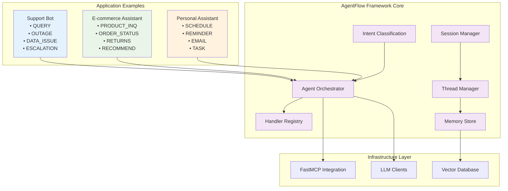
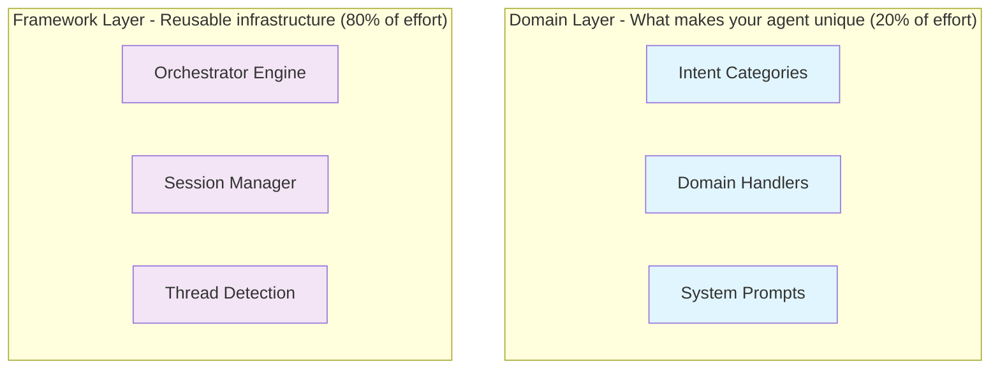
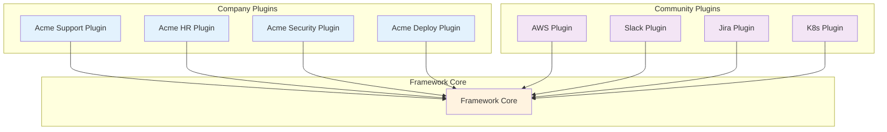
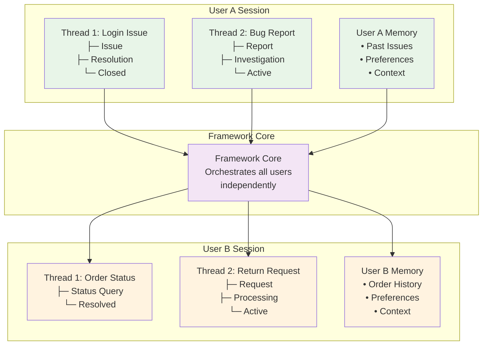
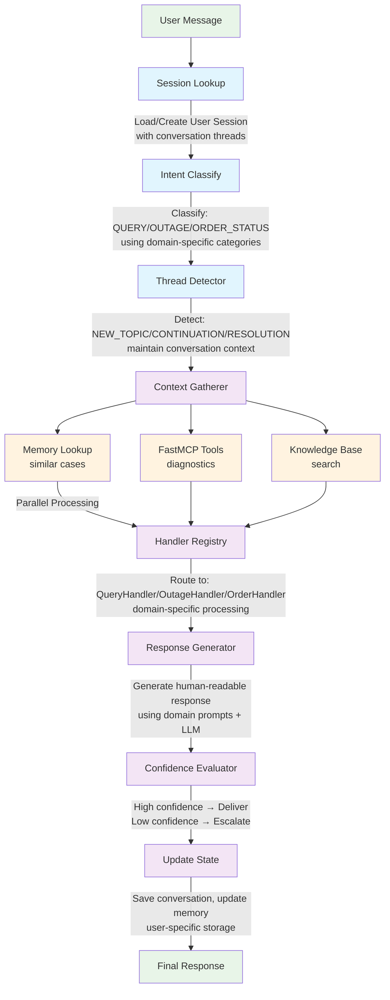
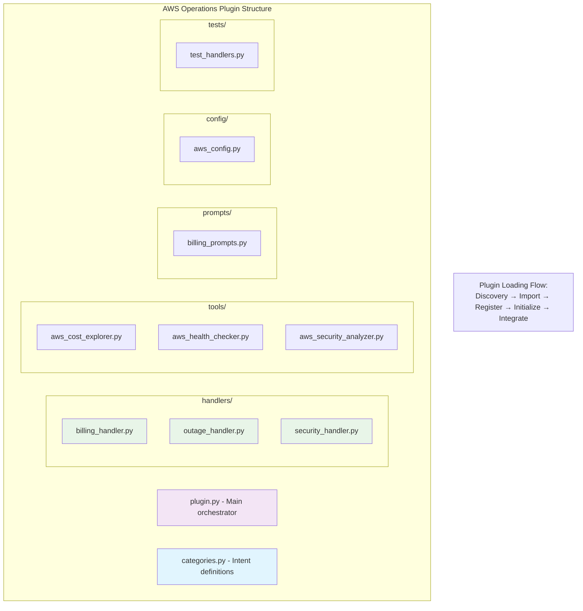
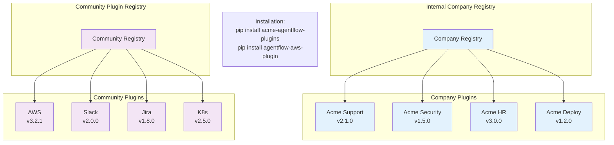
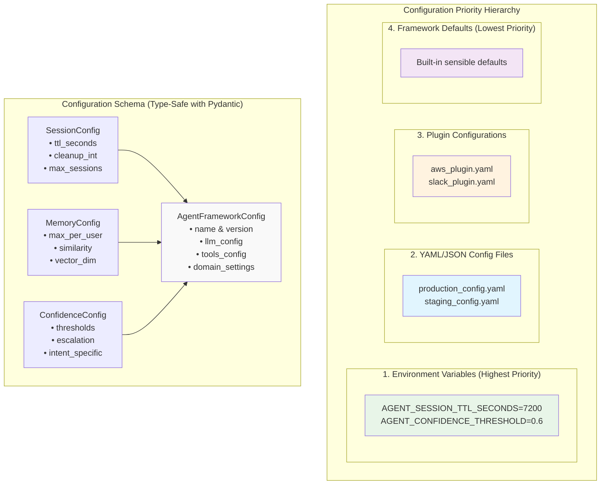
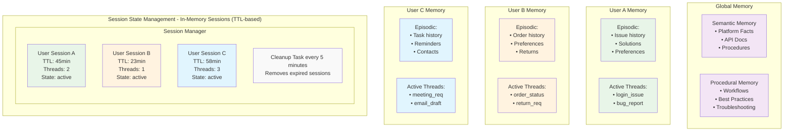
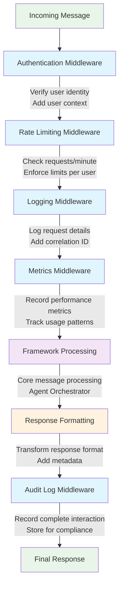

# AgentFlow Framework - High-Level Design

## Executive Summary

AgentFlow is a production-ready framework for building conversational AI agents that separates orchestration infrastructure (80% reusable) from domain logic (20% customizable). It enables teams to build sophisticated AI agents with consistent patterns, built-in best practices, and a thriving plugin ecosystem.

**Key Innovation**: Transform agentic app development from "build everything from scratch" to "configure domain behavior on robust infrastructure" - similar to how Express.js revolutionized web development.

## System Architecture Overview



## Core Design Principles

### 1. **Separation of Concerns**


### 2. **Plugin Architecture**


### 3. **User Isolation & Threading**


## Message Processing Flow



## Thread Detection System

```mermaid
flowchart TD
    NM[New Message:<br/>"Actually, I have a different question about S3"] --> MFA[Multi-Factor Analysis]
    
    MFA --> KA[Keyword Analysis<br/>"actually"<br/>"different"]
    MFA --> SA[Semantic Analysis<br/>Vector similarity<br/>< 0.3]
    MFA --> TA[Temporal Analysis<br/>30min gap]
    
    KA --> D[Decision Engine]
    SA --> D
    TA --> D
    
    D --> DEC[Decision:<br/>NEW_TOPIC<br/>Confidence: 0.8]
    DEC --> CNT[Create New Thread<br/>"S3_question_1435"]
    
    style MFA fill:#f3e5f5
    style KA fill:#e1f5fe
    style SA fill:#e1f5fe
    style TA fill:#e1f5fe
    style D fill:#fff3e0
    style DEC fill:#e8f5e8
    style CNT fill:#e8f5e8
```

**Thread Transition Types:**
- **NEW_TOPIC**: "Actually, different question about..."
- **FOLLOW_UP**: "And also, regarding that issue..."
- **CLARIFY**: "What do you mean by restart?"
- **ESCALATION**: "This is urgent, production is down"
- **RESOLUTION**: "Thanks, that fixed it!"
- **CONTINUE**: "Yes, that's exactly the problem"

## Plugin Ecosystem Design

### Plugin Internal Structure


### Plugin Distribution Model


## Configuration Architecture



## Builder Pattern Design

```mermaid
flowchart TD
    AFB[AgentFrameworkBuilder]
    
    AFB --> WC[.with_config 'production.yaml'<br/>Load & validate configuration]
    AFB --> WP[.with_plugins ['aws_plugin', 'slack_plugin']<br/>Auto-discover plugin modules<br/>Load intent categories, handlers, prompts, tools]
    AFB --> WM[.with_middleware [LoggingMiddleware, RateLimitMiddleware]<br/>Setup cross-cutting concerns]
    AFB --> WRL[.with_rate_limiting 120<br/>Add rate limiting middleware]
    AFB --> WL[.with_logging<br/>Add logging middleware]
    
    WC --> BUILD[.build llm_client, fastmcp_client]
    WP --> BUILD
    WM --> BUILD
    WRL --> BUILD
    WL --> BUILD
    
    BUILD --> CC[Create core components:<br/>IntentClassifier<br/>HandlerRegistry<br/>MemoryStore<br/>SessionManager<br/>ThreadManager<br/>ConfidenceEvaluator<br/>ToolManager]
    
    CC --> WD[Wire dependencies]
    WD --> AO[Return configured AgentOrchestrator]
    
    AO --> RESULT[Production-ready agent with domain-specific behavior]
    
    style AFB fill:#f3e5f5
    style BUILD fill:#e8f5e8
    style AO fill:#e1f5fe
    style RESULT fill:#fff3e0
```

## Memory & State Management



## Middleware Pipeline



**Middleware Benefits:**
- Cross-cutting concerns
- Easy to add/remove features
- Testable in isolation
- Production monitoring
```

## Deployment Architecture

```
Production Deployment Options:

┌─ Single Instance Deployment ─┐
│                               │
│  ┌─────────────────────────┐  │
│  │     AgentFlow App       │  │
│  │                         │  │
│  │ ┌─────┐ ┌─────┐ ┌─────┐ │  │
│  │ │Plugin│ │Core │ │LLM  │ │  │
│  │ │ Mgr │ │Engine│ │Client│ │  │
│  │ └─────┘ └─────┘ └─────┘ │  │
│  └─────────────────────────┘  │
│              │                │
│  ┌─────────────────────────┐  │
│  │    FastMCP Tools        │  │
│  └─────────────────────────┘  │
└───────────────────────────────┘

┌─ Microservices Deployment ─┐
│                             │
│ ┌─────────┐ ┌─────────────┐ │
│ │Agent    │ │ Plugin      │ │
│ │Core     │ │ Services    │ │
│ │Service  │ │             │ │
│ └─────────┘ └─────────────┘ │
│      │             │        │
│ ┌─────────┐ ┌─────────────┐ │
│ │Session  │ │ Tool        │ │
│ │Manager  │ │ Gateway     │ │
│ │Service  │ │             │ │
│ └─────────┘ └─────────────┘ │
│      │             │        │
│ ┌─────────────────────────┐ │
│ │    Message Bus/API GW   │ │
│ └─────────────────────────┘ │
└─────────────────────────────┘

┌─ Cloud-Native Deployment ─┐
│                            │
│  ┌─ Load Balancer ─┐       │
│  │                 │       │
│  ├─ Agent Pod 1 ───┤       │
│  ├─ Agent Pod 2 ───┤       │
│  ├─ Agent Pod N ───┤       │
│  │                 │       │
│  └─────────────────┘       │
│           │                │
│  ┌─────────────────┐       │
│  │   Redis Cache   │       │
│  │ (Session Store) │       │
│  └─────────────────┘       │
│           │                │
│  ┌─────────────────┐       │
│  │  Vector DB      │       │
│  │ (Memory Store)  │       │
│  └─────────────────┘       │
└────────────────────────────┘
```

## Scalability & Performance

```
Performance Characteristics:

┌─ Async Processing Benefits ─┐
│                             │
│ Traditional Sync:           │
│ ┌─────┐ ┌─────┐ ┌─────┐     │
│ │Req 1│ │Req 2│ │Req 3│     │
│ └─────┘ └─────┘ └─────┘     │
│ │   5s  │   5s  │   5s      │
│ └───────┴───────┴─────────► │
│        Total: 15s           │
│                             │
│ AgentFlow Async:            │
│ ┌─────┐                     │
│ │Req 1│                     │
│ │Req 2│ ◄─ Parallel         │
│ │Req 3│                     │
│ └─────┘                     │
│ │   5s                      │
│ └─────────────────────────► │
│        Total: 5s            │
└─────────────────────────────┘

Concurrent User Handling:
┌─────────────────────────────┐
│     500+ Concurrent Users   │
│                             │
│ User A ─┐                   │
│ User B ─┤                   │
│ User C ─┤ ► AgentFlow ───►   │
│ User D ─┤     Core          │
│ ...    ─┤                   │
│ User N ─┘                   │
│                             │
│ • Per-user isolation        │
│ • Independent processing    │
│ • Shared infrastructure     │
│ • Memory-efficient          │
└─────────────────────────────┘

Throughput Targets:
• Response Time: < 5s (95th percentile)
• Memory Ops: < 1s (similarity search)
• Concurrent Sessions: 500+ users
• Hourly Throughput: 2000+ messages/hour
```

## Framework Benefits Summary

```
┌─────────────────────────────────────────────────────────────────┐
│                    Value Proposition                           │
├─────────────────────────────────────────────────────────────────┤
│ Before AgentFlow:                                               │
│ ┌─────────────────┐                                             │
│ │ Build from      │ ◄── 100% custom development                 │
│ │ Scratch         │     • Session management                    │
│ │                 │     • Thread detection                      │
│ │ • 6-12 months   │     • Memory systems                       │
│ │ • High risk     │     • Tool integration                     │
│ │ • No standards  │     • Confidence evaluation                │
│ │ • Team silos    │     • Error handling                       │
│ └─────────────────┘     • User isolation                       │
├─────────────────────────────────────────────────────────────────┤
│ With AgentFlow:                                                 │
│ ┌─────────────────┐                                             │
│ │ Configure       │ ◄── 20% domain customization                │
│ │ Domain Logic    │     • Intent categories                     │
│ │                 │     • Domain handlers                       │
│ │ • 2-4 weeks     │     • System prompts                       │
│ │ • Low risk      │     • Tool configurations                  │
│ │ • Best practices│                                             │
│ │ • Team sharing  │ ◄── 80% reusable infrastructure            │
│ └─────────────────┘     Built-in & battle-tested               │
├─────────────────────────────────────────────────────────────────┤
│ Result: 10x faster development with production-ready quality    │
└─────────────────────────────────────────────────────────────────┘
```

## Implementation Roadmap

```
┌─ Phase 1: Core Framework (4-6 weeks) ─┐
│                                        │
│ ┌─────────────────────────────────────┐│
│ │ • Agent Orchestrator                ││
│ │ • Session Management                ││
│ │ • Intent Classification             ││
│ │ • Handler Registry                  ││
│ │ • Basic Configuration               ││
│ └─────────────────────────────────────┘│
└────────────────────────────────────────┘

┌─ Phase 2: Advanced Features (3-4 weeks) ─┐
│                                           │
│ ┌─────────────────────────────────────────┐│
│ │ • Thread Detection System               ││
│ │ • Memory Management                     ││
│ │ • Confidence Evaluation                 ││
│ │ • Middleware Pipeline                   ││
│ │ • FastMCP Integration                   ││
│ └─────────────────────────────────────────┘│
└───────────────────────────────────────────┘

┌─ Phase 3: Plugin System (2-3 weeks) ─┐
│                                       │
│ ┌─────────────────────────────────────┐│
│ │ • Plugin Interface & Protocol       ││
│ │ • Plugin Manager & Discovery        ││
│ │ • Example Plugins (AWS, Slack)      ││
│ │ • Plugin Packaging & Distribution   ││
│ └─────────────────────────────────────┘│
└───────────────────────────────────────┘

┌─ Phase 4: Production Features (2-3 weeks) ─┐
│                                             │
│ ┌─────────────────────────────────────────── ┐│
│ │ • Production Configuration Management    ││
│ │ • Comprehensive Testing Suite            ││
│ │ • Documentation & Examples               ││
│ │ • Performance Optimization              ││
│ │ • Deployment Templates                  ││
│ └─────────────────────────────────────────┘│
└─────────────────────────────────────────────┘

Total Timeline: 11-16 weeks for complete framework
```

## Success Metrics

```
Framework Adoption Metrics:
┌─────────────────────────────────────────────────────────────────┐
│ Developer Experience:                                           │
│ • Time to first working agent: < 1 day                         │
│ • Lines of custom code required: < 500 (vs 5000+ from scratch) │
│ • Plugin installation time: < 5 minutes                        │
│                                                                 │
│ Technical Performance:                                          │
│ • Framework overhead: < 100ms per request                      │
│ • Memory efficiency: < 50MB per 100 concurrent users           │
│ • Plugin load time: < 2 seconds                                │
│                                                                 │
│ Ecosystem Growth:                                               │
│ • Community plugins: 20+ within 6 months                       │
│ • Company adoption: 5+ teams within first year                 │
│ • Plugin marketplace: Active contribution model                │
└─────────────────────────────────────────────────────────────────┘
```

**AgentFlow transforms conversational AI development from "build everything" to "configure domain behavior" - enabling teams to focus on what makes their agent unique while leveraging battle-tested infrastructure for everything else.**