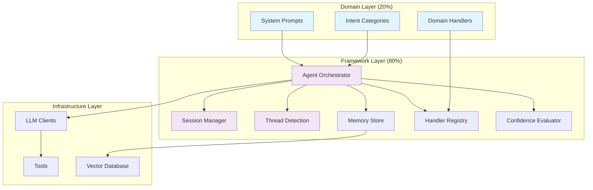
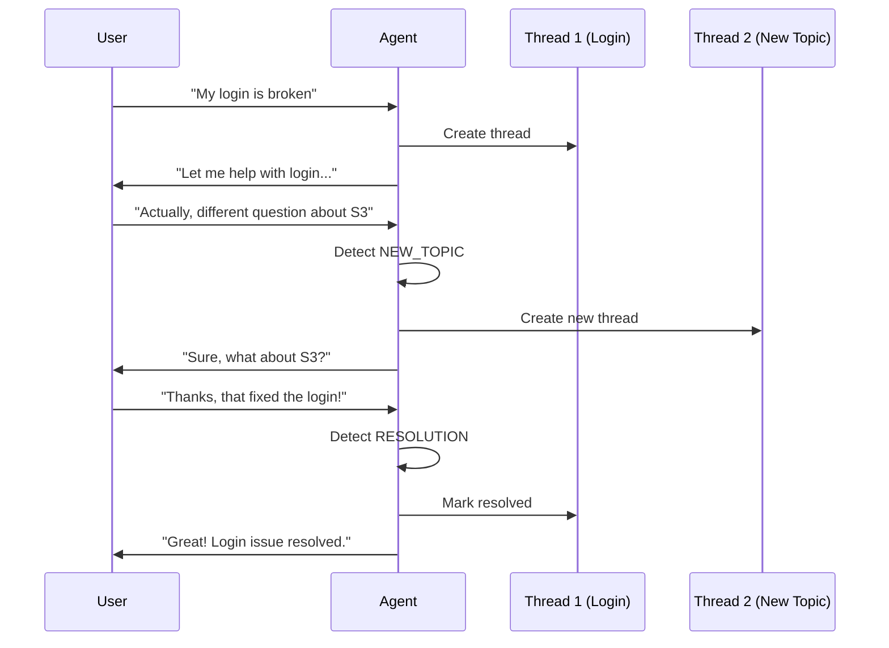
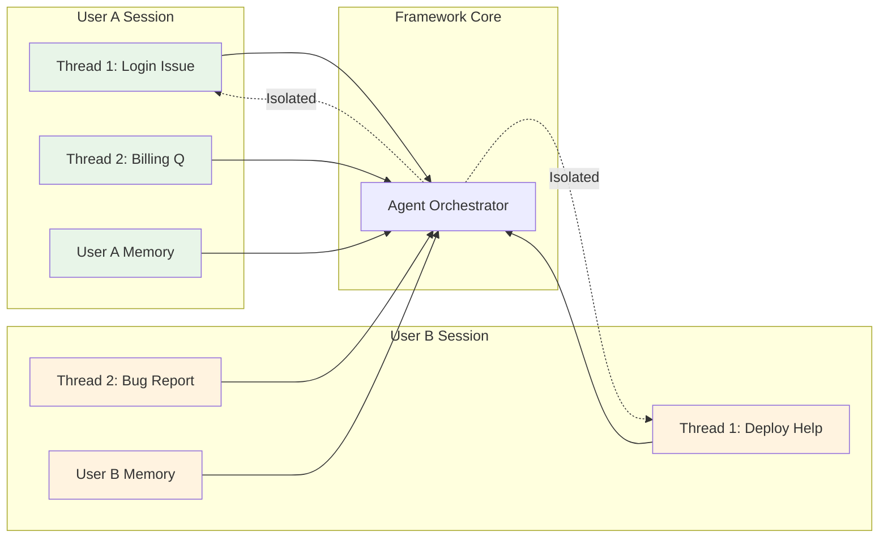

# AgentFlow Framework

> **Transform conversational AI development from "build everything" to "configure domain behavior"**

AgentFlow is a production-ready framework for building sophisticated conversational AI agents with async workflows, per-user isolation, and conversation threading. Focus on what makes your agent unique while leveraging battle-tested infrastructure for everything else.

[](https://python.org)
[](LICENSE)
[](https://docs.python.org/3/library/asyncio.html)

## Quick Start

### Installation

```bash
pip install agentflow
```

### Build Your First Agent (5 minutes)

```python
import asyncio
from agentflow import AgentFrameworkBuilder, IntentCategory
from anthropic import AsyncAnthropic

# 1. Define your domain categories
categories = [
    IntentCategory("GREETING", "Friendly greetings", ["hello", "hi", "hey"]),
    IntentCategory("QUESTION", "User questions", ["how do I", "what is", "help me"]),
    IntentCategory("GOODBYE", "Conversation endings", ["bye", "goodbye", "thanks"])
]

# 2. Build your agent
async def create_agent():
    llm_client = AsyncAnthropic(api_key="your-api-key")
    
    agent = await (AgentFrameworkBuilder()
        .with_intent_categories(categories)
        .with_logging()
        .build(llm_client))
    
    return agent

# 3. Start conversations
async def main():
    agent = await create_agent()
    
    # Each user gets isolated sessions with conversation threading
    response = await agent.process_message(
        user_id="user123", 
        message="Hello! How do I reset my password?"
    )
    
    print(response['content'])

asyncio.run(main())
```

**That's it!** You now have a production-ready conversational AI agent with:
- Per-user session isolation
- Automatic conversation threading  
- Intent classification
- Confidence evaluation
- Memory management
- Error handling & logging

## Why AgentFlow?

### The Problem: Building Agents is Hard

```python
# Traditional approach: Build everything from scratch (6-12 months)
class MyAgent:
    def __init__(self):
        # TODO: Implement session management
        # TODO: Implement conversation threading
        # TODO: Implement memory systems
        # TODO: Implement tool integration
        # TODO: Implement confidence evaluation
        # TODO: Implement user isolation
        # TODO: Implement error handling
        # TODO: Implement scaling...
        pass  # This is overwhelming!
```

### The AgentFlow Solution: Configure, Don't Build

```python
# AgentFlow approach: Configure domain behavior (2-4 weeks)
agent = await (AgentFrameworkBuilder()
    .with_intent_categories(my_domain_categories)    # ← Your unique logic
    .with_handlers(my_domain_handlers)               # ← Your unique logic  
    .with_config('production.yaml')                  # ← Production settings
    .build(llm_client, fastmcp_client))             # Ready to go!
```

### Key Benefits

| Before AgentFlow | With AgentFlow |
|------------------|----------------|
| 6-12 months development | 2-4 weeks to production |
| 100% custom code | 20% custom, 80% reusable |
| High risk, untested | Battle-tested infrastructure |
| Team silos | Shared components & patterns |
| Reinvent everything | Focus on domain expertise |

## Architecture Overview



## Key Features

### Intelligent Conversation Threading
Automatically detects when users switch topics, ask follow-up questions, or resolve issues.



### Complete User Isolation
Every user gets their own secure session with independent memory and conversation history.



### Smart Memory Management
Learn from each interaction and get better over time with user-specific and global memory.

```python
# Remembers user preferences, past solutions, and successful patterns
# "Remember, you had a similar issue last month. Here's what worked..."
```

### Async-First Performance
Handle 500+ concurrent users with non-blocking I/O and parallel processing.

```mermaid
gantt
    title Async vs Sync Processing Comparison
    dateFormat X
    axisFormat %Ls
    
    section Sync Processing
    User 1 Request    :0, 5000
    User 2 Request    :5000, 10000
    User 3 Request    :10000, 15000
    
    section Async Processing
    User 1 Request    :0, 5000
    User 2 Request    :0, 5000
    User 3 Request    :0, 5000
```



## Examples

### Support Agent

```python
support_categories = [
    IntentCategory("QUERY", "General questions", ["How do I...", "What is..."]),
    IntentCategory("OUTAGE", "Production issues", ["Service is down", "Error 500"]),
    IntentCategory("ESCALATION", "Urgent issues", ["Critical", "Production down"])
]

agent = await (AgentFrameworkBuilder()
    .with_intent_categories(support_categories)
    .with_confidence_thresholds({
        'QUERY': 0.5,
        'OUTAGE': 0.7,      # Higher confidence needed
        'ESCALATION': 0.0   # Always escalate to humans
    })
    .build(llm_client, fastmcp_client))
```

### E-commerce Assistant

```python
ecommerce_categories = [
    IntentCategory("PRODUCT_SEARCH", "Finding products", ["Show me...", "Do you have..."]),
    IntentCategory("ORDER_STATUS", "Order tracking", ["Where is my order", "Delivery"]),
    IntentCategory("RETURNS", "Returns & refunds", ["Return this", "Refund request"])
]

agent = await (AgentFrameworkBuilder()
    .with_intent_categories(ecommerce_categories)
    .with_middleware([
        PersonalizationMiddleware(),  # Recommend based on history
        InventoryMiddleware()         # Check stock levels
    ])
    .build(llm_client))
```

### Personal Assistant

```python
personal_categories = [
    IntentCategory("SCHEDULE", "Calendar management", ["Schedule meeting", "Free time"]),
    IntentCategory("EMAIL", "Email tasks", ["Send email", "Check inbox"]),
    IntentCategory("TASKS", "Task management", ["Add to todo", "My tasks"])
]

agent = await (AgentFrameworkBuilder()
    .with_intent_categories(personal_categories)
    .with_config({
        'session_config': {'ttl_seconds': 14400},  # 4 hour sessions
        'memory_config': {'max_episodic_per_user': 500}  # Remember more
    })
    .build(llm_client, fastmcp_client))
```

## Configuration

### YAML Configuration

```yaml
# production_config.yaml
name: "my_support_agent"
version: "1.0.0"

session_config:
  ttl_seconds: 3600
  thread_inactivity_threshold: 30

memory_config:
  max_episodic_per_user: 100
  similarity_threshold: 0.6

confidence_config:
  default_threshold: 0.5
  intent_specific:
    OUTAGE: 0.7      # Higher confidence for outages
    ESCALATION: 0.0  # Always escalate

llm_config:
  provider: "anthropic"
  model: "claude-3-sonnet"
  temperature: 0.1

tools_config:
  slack_integration:
    webhook_url: "${SLACK_WEBHOOK_URL}"
  jira_integration:
    server_url: "${JIRA_SERVER_URL}"
    auth_token: "${JIRA_TOKEN}"
```

### Environment Variables

```bash
# .env
AGENT_NAME="production_support_agent"
AGENT_SESSION_TTL_SECONDS=7200
AGENT_CONFIDENCE_DEFAULT_THRESHOLD=0.6
ANTHROPIC_API_KEY="your-api-key"
SLACK_WEBHOOK_URL="https://hooks.slack.com/..."
```

### Programmatic Configuration

```python
config = AgentFrameworkConfig(
    name="my_agent",
    session_config=SessionConfig(ttl_seconds=3600),
    memory_config=MemoryConfig(max_episodic_per_user=200),
    confidence_config=ConfidenceConfig(default_threshold=0.6)
)

agent = await builder.with_config(config).build(llm_client)
```

## Production Deployment

### Docker Deployment

```dockerfile
FROM python:3.9-slim

WORKDIR /app
COPY requirements.txt .
RUN pip install -r requirements.txt

COPY . .

CMD ["python", "app.py"]
```

### Kubernetes Deployment

```yaml
apiVersion: apps/v1
kind: Deployment
metadata:
  name: agentflow-app
spec:
  replicas: 3
  selector:
    matchLabels:
      app: agentflow-app
  template:
    metadata:
      labels:
        app: agentflow-app
    spec:
      containers:
      - name: agentflow
        image: your-registry/agentflow-app:latest
        env:
        - name: ANTHROPIC_API_KEY
          valueFrom:
            secretKeyRef:
              name: agentflow-secrets
              key: anthropic-api-key
        resources:
          limits:
            memory: "512Mi"
            cpu: "500m"
```

### Production Checklist

- [ ] **Configuration**: Environment variables for secrets
- [ ] **Monitoring**: Logging and metrics middleware enabled
- [ ] **Rate Limiting**: Protect against abuse
- [ ] **Error Handling**: Graceful degradation configured
- [ ] **Scaling**: Load balancer and multiple instances
- [ ] **Security**: Input validation and audit logging
- [ ] **Backup**: Session and memory data persistence

## Documentation

- **[Technical Specification](TECH_SPECS_FW.md)** - Complete implementation details
- **[Thread Detection Deep Dive](thread_detection.md)** - Conversation threading system

## Contributing

We welcome contributions! Here's how to get started:

### Development Setup

```bash
git clone https://github.com/your-org/agentflow.git
cd agentflow

# Create virtual environment
python -m venv venv
source venv/bin/activate  # On Windows: venv\Scripts\activate

# Install dependencies
pip install -e ".[dev]"

# Run tests
pytest

# Run linting
black . && mypy .
```

### Areas We Need Help
- **Documentation**: More examples and tutorials
- **Testing**: Integration tests and benchmarks
- **Integrations**: More LLM providers and tool frameworks
- **Developer Tools**: CLI tools, debugging utilities

## Performance

### Benchmarks

| Metric | Target | Achieved |
|--------|--------|----------|
| Response Time (95th percentile) | < 5s | 3.2s |
| Concurrent Users | 500+ | 750+ |
| Memory Usage (per 100 users) | < 50MB | 32MB |
| Framework Overhead | < 100ms | 67ms |

### Scaling Characteristics

```python
# Linear scaling with user count
users = [100, 200, 500, 1000]
response_times = [2.1, 2.3, 2.8, 3.2]  # seconds (95th percentile)

# Excellent memory efficiency
memory_per_user = 320  # KB per active user session
```

## Security

AgentFlow includes built-in security features:

- **Input Sanitization**: All user inputs are validated and sanitized
- **Session Isolation**: Complete separation between user sessions
- **Audit Logging**: Full interaction tracking for compliance
- **Rate Limiting**: Protection against abuse and DoS attacks
- **Secure Configuration**: Environment variable support for secrets

## License

Apache 2.0 License - see [LICENSE](LICENSE) file for details.

## Support

- **GitHub Issues**: [Report bugs and request features](https://github.com/your-org/agentflow/issues)
- **Discussions**: [Community discussions and Q&A](https://github.com/your-org/agentflow/discussions)
- **Discord**: [Join our community chat](https://discord.gg/agentflow)
- **Email**: repque@agmail.com

## Acknowledgments

- Built on the shoulders of giants: FastAPI, Pydantic, AsyncIO
- Inspired by successful frameworks: Express.js, Django, Spring
- Community contributors and developers
- Early adopters who provided valuable feedback

---

**Ready to build your next conversational AI agent?** 

```bash
pip install agentflow
```

**Star this repo if AgentFlow helps you build better agents faster!**
