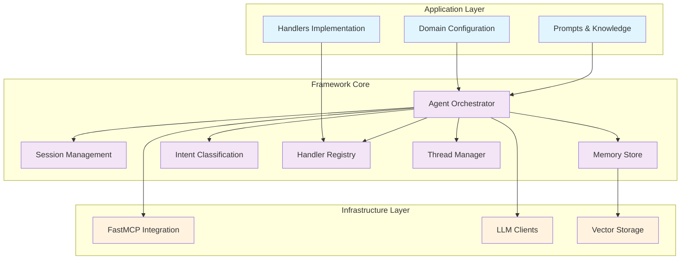
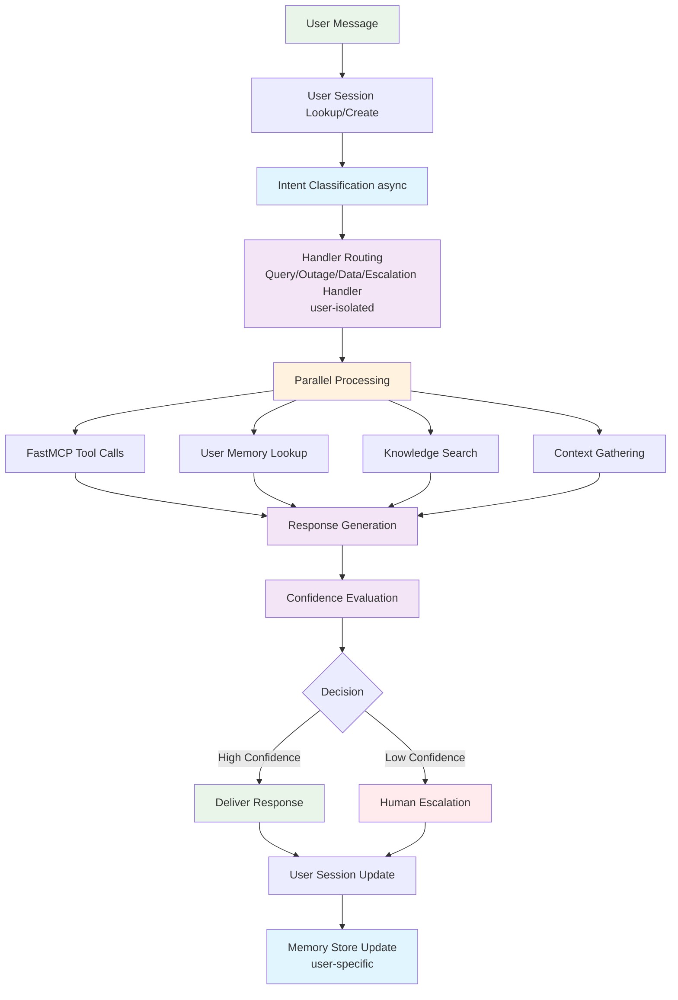

# AgentFlow Framework Technical Specification

## Overview

AgentFlow is a comprehensive, production-ready framework for building conversational AI agents with async workflows, per-user isolation, conversation threading, and pluggable domain logic. It abstracts common patterns found in agentic applications while allowing complete customization of domain-specific behavior.

**Key Innovation**: Separates orchestration infrastructure (80% reusable) from domain logic (20% customizable), enabling teams to build conversational AI systems with consistent patterns, best practices, and shared components across any domain.

## Framework Architecture

### Three-Layer Design



### Workflow Flow (Per-User Async)



## Core Framework Components

### 1. Agent Orchestrator

```python
import asyncio
from typing import Dict, Any, Optional, List
from datetime import datetime

class AgentOrchestrator:
    """Core framework orchestrator - domain agnostic"""
    
    def __init__(
        self, 
        config: AgentConfig,
        intent_classifier: 'IntentClassifier',
        handler_registry: 'HandlerRegistry',
        memory_store: 'MemoryStore',
        session_manager: 'SessionManager',
        thread_manager: 'ThreadManager',
        confidence_evaluator: 'ConfidenceEvaluator',
        tool_manager: 'ToolManager'
    ):
        self.config = config
        self.intent_classifier = intent_classifier
        self.handler_registry = handler_registry
        self.memory_store = memory_store
        self.session_manager = session_manager
        self.thread_manager = thread_manager
        self.confidence_evaluator = confidence_evaluator
        self.tool_manager = tool_manager
        
    async def process_message(
        self, 
        user_id: str, 
        message: str, 
        context: Optional[dict] = None
    ) -> dict:
        """Main async workflow orchestration per user"""
        
        # 1. Session Management
        session = await self.session_manager.get_or_create_session(user_id)
        
        # 2. Intent Classification
        intent = await self.intent_classifier.classify(
            message, session.conversation_history, context
        )
        
        # 3. Thread Management
        active_thread, new_thread_created = await self.thread_manager.process_message_with_thread_detection(
            session, message, intent
        )
        
        # 4. Context Gathering
        processing_context = await self._gather_context(
            intent, session, active_thread, context
        )
        
        # 5. Handler Routing
        response = await self.handler_registry.route_and_handle(
            intent, processing_context, session, active_thread
        )
        
        # 6. Confidence Evaluation
        confidence_result = await self.confidence_evaluator.evaluate(
            response, processing_context, intent
        )
        
        # 7. Response Finalization
        final_response = await self._finalize_response(
            response, confidence_result, session, active_thread
        )
        
        # 8. State Updates
        await self._update_state(session, active_thread, final_response, intent)
        
        return final_response
```

### 2. Session Management (Per-User Isolation)

```python
class ConversationThread:
    """Represents a single conversation thread within a user session"""
    def __init__(self, thread_id: str, initial_message: str, intent_type: str):
        self.thread_id = thread_id
        self.messages = []
        self.intent_type = intent_type
        self.initial_topic = initial_message
        self.created_at = datetime.now()
        self.last_message_at = datetime.now()
        self.status = "active"  # active, resolved, abandoned
        self.resolution_summary = None

class SupportSession:
    """Per-user session state with conversation thread management"""
    def __init__(self, user_id: str, session_id: str):
        self.user_id = user_id
        self.session_id = session_id
        self.conversation_history = []  # Global message history
        self.threads: Dict[str, ConversationThread] = {}  # Active conversation threads
        self.current_thread_id: Optional[str] = None
        self.context = {}
        self.current_state = "start"
        self.confidence_score = 0.0
        self.created_at = datetime.now()
        self.last_accessed = datetime.now()
        self.ttl_seconds = 3600  # 1 hour
        self.thread_inactivity_threshold = 30  # minutes

class SessionManager:
    """In-memory session management with TTL and per-user isolation"""
    def __init__(self):
        self.sessions: Dict[str, SupportSession] = {}
        self._locks: Dict[str, asyncio.Lock] = {}
        self._cleanup_task: Optional[asyncio.Task] = None
    
    async def get_or_create_session(self, user_id: str) -> SupportSession:
        """Get existing session or create new one"""
        session = await self.load_session(user_id)
        if session is None:
            session = await self.create_session(user_id)
        return session
```

### 3. Conversation Thread Detection

```python
from enum import Enum

class ThreadTransitionType(Enum):
    """Types of thread transitions"""
    NEW_TOPIC = "new_topic"           # Completely different subject
    FOLLOW_UP = "follow_up"           # Related to previous thread
    CLARIFICATION = "clarification"   # Asking for more details
    ESCALATION = "escalation"         # Moving to higher urgency
    RESOLUTION = "resolution"         # Marking something as solved
    CONTINUATION = "continuation"     # Same thread continues

class ThreadDetector:
    """Detects conversation thread transitions within user sessions"""
    
    def __init__(self, llm_client):
        self.llm_client = llm_client
        self.transition_keywords = {
            'new_topic': ['actually', 'by the way', 'also', 'another thing'],
            'follow_up': ['and', 'also', 'furthermore', 'in addition'],
            'clarification': ['what do you mean', 'can you explain', 'how do I'],
            'escalation': ['urgent', 'critical', 'emergency', 'production down'],
            'resolution': ['solved', 'fixed', 'resolved', 'working now']
        }
    
    async def detect_thread_transition(
        self, 
        new_message: str,
        current_thread: Optional[ConversationThread],
        session_context: dict
    ) -> Tuple[ThreadTransitionType, float, dict]:
        """
        Detect if new message starts a new thread or continues existing one
        
        Returns:
            - ThreadTransitionType: Type of transition
            - float: Confidence score (0.0-1.0)
            - dict: Additional context about the transition
        """
        
        # Multi-factor analysis
        keyword_analysis = await self._analyze_keywords(new_message)
        semantic_analysis = await self._analyze_semantic_similarity(new_message, current_thread)
        temporal_analysis = self._analyze_temporal_patterns(current_thread)
        
        # Combine analyses for final decision
        return await self._combine_analyses(
            keyword_analysis, semantic_analysis, temporal_analysis, new_message, current_thread
        )
```

### 4. Memory Management (User-Isolated)

```python
from collections import defaultdict

class MemoryStore:
    """Async memory store with per-user data isolation"""
    def __init__(self):
        self.semantic_memory = {}  # Global platform knowledge
        self.user_episodic_memory = defaultdict(list)  # Per-user conversation history
        self.procedural_memory = {}  # Shared troubleshooting workflows
        self._locks = defaultdict(asyncio.Lock)  # Per-user locks for thread safety
        
    async def add_episodic_case(self, user_id: str, case_data: dict):
        """Add resolved case to user-specific history"""
        async with self._locks[f'episodic_{user_id}']:
            self.user_episodic_memory[user_id].append({
                'timestamp': case_data['timestamp'],
                'issue_type': case_data['type'],
                'context': case_data['context'],
                'solution': case_data['solution'],
                'effectiveness': case_data.get('effectiveness', 0.0),
                'user_id': user_id
            })
            
            # Keep only last 100 cases per user to manage memory
            if len(self.user_episodic_memory[user_id]) > 100:
                self.user_episodic_memory[user_id] = self.user_episodic_memory[user_id][-100:]
    
    async def aretrieve_similar_cases(self, query: str, user_id: str, limit: int = 5) -> list:
        """Find similar cases using vector similarity (user-specific + global)"""
        async with self._locks[f'episodic_{user_id}']:
            user_cases = self.user_episodic_memory.get(user_id, [])
            
        # Combine user-specific cases with successful cases from other users (anonymized)
        all_cases = user_cases.copy()
        for other_user_id, cases in self.user_episodic_memory.items():
            if other_user_id != user_id:
                successful_cases = [
                    {**case, 'user_id': 'anonymized'} 
                    for case in cases 
                    if case.get('effectiveness', 0) > 0.8
                ]
                all_cases.extend(successful_cases[-10:])  # Last 10 successful cases
        
        similar_cases = await self._basic_similarity_search(query, all_cases, limit)
        return similar_cases
```

### 5. Intent Classification (Pluggable)

```python
class IntentCategory:
    """Represents a single intent category"""
    def __init__(self, name: str, description: str, examples: List[str], confidence_threshold: float = 0.5):
        self.name = name
        self.description = description
        self.examples = examples
        self.confidence_threshold = confidence_threshold
        self.keywords = []
        self.patterns = []

class IntentClassifier:
    """Generic intent classifier with pluggable categories"""
    
    def __init__(self, llm_client, categories: List[IntentCategory], system_prompt_template: str):
        self.llm_client = llm_client
        self.categories = {cat.name: cat for cat in categories}
        self.system_prompt_template = system_prompt_template
        
    async def classify(self, message: str, history: List[dict], context: Optional[dict] = None) -> dict:
        """Classify message intent using configured categories"""
        
        # Build dynamic prompt with categories
        categories_description = self._build_categories_description()
        prompt = self.system_prompt_template.format(
            categories=categories_description,
            message=message,
            history=self._format_history(history[-3:]),  # Last 3 messages
            context=context or {}
        )
        
        try:
            result = await self.llm_client.agenerate(prompt)
            return self._parse_classification_result(result, message)
        except Exception as e:
            return self._fallback_classification(message, e)
```

### 6. Handler Registry (Pluggable)

```python
from abc import ABC, abstractmethod

class BaseHandler(ABC):
    """Abstract base handler for framework"""
    
    @abstractmethod
    async def can_handle(self, intent: dict, context: dict) -> bool:
        """Determine if this handler can process the intent"""
        pass
        
    @abstractmethod
    async def handle(
        self, 
        message: str, 
        intent: dict,
        context: dict, 
        session: 'Session',
        thread: Optional['ConversationThread']
    ) -> dict:
        """Process the request"""
        pass
    
    @abstractmethod
    def get_priority(self) -> int:
        """Return handler priority (higher = more priority)"""
        pass

class HandlerRegistry:
    """Registry for pluggable handlers"""
    
    def __init__(self):
        self.handlers: List[BaseHandler] = []
        self._handler_cache: Dict[str, BaseHandler] = {}
    
    def register_handler(self, handler: BaseHandler):
        """Register a new handler"""
        self.handlers.append(handler)
        # Sort by priority (highest first)
        self.handlers.sort(key=lambda h: h.get_priority(), reverse=True)
        self._handler_cache.clear()  # Clear cache
    
    async def route_and_handle(
        self, 
        intent: dict, 
        context: dict, 
        session: 'Session',
        thread: Optional['ConversationThread']
    ) -> dict:
        """Route to appropriate handler"""
        
        # Find appropriate handler
        for handler in self.handlers:
            try:
                if await handler.can_handle(intent, context):
                    return await handler.handle(
                        context['original_message'], intent, context, session, thread
                    )
            except Exception as e:
                # Log error and continue to next handler
                print(f"Handler {handler.__class__.__name__} failed: {e}")
                continue
        
        # No handler found
        return {
            'content': 'I apologize, but I cannot handle this type of request at the moment.',
            'error': 'no_handler_found',
            'intent_type': intent.get('type'),
            'fallback': True
        }
```

### 7. FastMCP Integration

```python
from fastmcp import FastMCPClient

class FastMCPToolManager:
    """Async MCP tool manager using FastMCP for better performance"""
    def __init__(self, mcp_server_config: dict):
        self.client = FastMCPClient(mcp_server_config)
        self.available_tools = {}
        self._initialized = False
        
    async def initialize(self):
        """Initialize FastMCP client and discover available tools"""
        if not self._initialized:
            await self.client.connect()
            self.available_tools = await self.client.list_tools()
            self._initialized = True
    
    async def call_tool(self, tool_name: str, parameters: dict, user_id: str = None) -> dict:
        """Execute MCP tool with error handling and user context"""
        if not self._initialized:
            await self.initialize()
            
        try:
            # Add user context to all tool calls for isolation
            enhanced_params = {
                **parameters,
                '_user_context': {
                    'user_id': user_id,
                    'timestamp': datetime.now().isoformat()
                }
            }
            
            result = await self.client.call_tool(tool_name, enhanced_params)
            return {
                'success': True,
                'result': result,
                'tool_name': tool_name,
                'user_id': user_id
            }
            
        except Exception as e:
            return {
                'success': False,
                'error': str(e),
                'tool_name': tool_name,
                'user_id': user_id,
                'fallback': True
            }
    
    async def call_tools_parallel(self, tool_calls: list, user_id: str = None) -> list:
        """Execute multiple tools in parallel for better performance"""
        tasks = [
            self.call_tool(call['tool_name'], call['parameters'], user_id)
            for call in tool_calls
        ]
        
        results = await asyncio.gather(*tasks, return_exceptions=True)
        
        # Handle exceptions in results
        processed_results = []
        for i, result in enumerate(results):
            if isinstance(result, Exception):
                processed_results.append({
                    'success': False,
                    'error': str(result),
                    'tool_name': tool_calls[i]['tool_name'],
                    'user_id': user_id,
                    'fallback': True
                })
            else:
                processed_results.append(result)
        
        return processed_results
```

## Plugin System Architecture

### 1. Plugin Interface

```python
from typing import Protocol, runtime_checkable

@runtime_checkable
class AgentPlugin(Protocol):
    """Protocol for agent plugins"""
    
    def get_intent_categories(self) -> List[IntentCategory]:
        """Return intent categories provided by this plugin"""
        ...
    
    def get_handlers(self) -> List[BaseHandler]:
        """Return handlers provided by this plugin"""
        ...
    
    def get_prompts(self) -> Dict[str, str]:
        """Return prompt templates provided by this plugin"""
        ...
    
    def get_tools_config(self) -> Dict[str, dict]:
        """Return tool configurations provided by this plugin"""
        ...
```

### 2. Plugin Manager

```python
class PluginManager:
    """Manages plugin discovery and loading"""
    
    def __init__(self):
        self.loaded_plugins: Dict[str, AgentPlugin] = {}
    
    def discover_plugins(self, package_name: str = "agentflow_plugins") -> List[str]:
        """Discover available plugins in a package"""
        try:
            package = importlib.import_module(package_name)
            plugins = []
            
            for importer, modname, ispkg in pkgutil.iter_modules(package.__path__, package.__name__ + "."):
                if not ispkg:
                    plugins.append(modname)
            
            return plugins
        except ImportError:
            return []
    
    def load_plugin(self, plugin_name: str) -> Optional[AgentPlugin]:
        """Load a specific plugin"""
        try:
            module = importlib.import_module(plugin_name)
            
            # Look for plugin class or create_plugin function
            if hasattr(module, 'create_plugin'):
                plugin = module.create_plugin()
            elif hasattr(module, 'Plugin'):
                plugin = module.Plugin()
            else:
                raise ValueError(f"Plugin {plugin_name} must have 'create_plugin()' function or 'Plugin' class")
            
            if isinstance(plugin, AgentPlugin):
                self.loaded_plugins[plugin_name] = plugin
                return plugin
            else:
                raise ValueError(f"Plugin {plugin_name} does not implement AgentPlugin protocol")
                
        except Exception as e:
            print(f"Failed to load plugin {plugin_name}: {e}")
            return None
```

### 3. Example Plugin Structure

```python
# Example: aws_operations_plugin/plugin.py
class AWSOperationsPlugin:
    """AWS Operations Plugin for AgentFlow"""
    
    def __init__(self, aws_access_key: str = None, aws_secret_key: str = None, 
                 aws_region: str = "us-east-1", config: Dict[str, Any] = None):
        self.config = AWSPluginConfig(**(config or {}))
        
        # Initialize AWS tools with credentials
        self.cost_explorer = AWSCostExplorer(
            access_key=aws_access_key,
            secret_key=aws_secret_key,
            region=aws_region
        )
        
        # Initialize handlers with tools
        self.billing_handler = AWSBillingHandler(
            cost_explorer=self.cost_explorer,
            config=self.config.billing_config
        )
    
    def get_intent_categories(self) -> List[IntentCategory]:
        """Return AWS-specific intent categories"""
        return [
            IntentCategory(
                "AWS_BILLING",
                "AWS cost, billing, and budget-related questions",
                ["Why is my AWS bill so high?", "Show me cost breakdown"],
                confidence_threshold=0.7
            ),
            IntentCategory(
                "AWS_OUTAGE",
                "AWS service outages, performance issues",
                ["S3 is responding slowly", "Lambda functions timing out"],
                confidence_threshold=0.8
            )
        ]
    
    def get_handlers(self) -> List[BaseHandler]:
        """Return AWS-specific handlers"""
        return [self.billing_handler]
    
    def get_prompts(self) -> Dict[str, str]:
        """Return AWS-specific system prompts"""
        return {
            'aws_billing_analysis': """
                You are an AWS billing expert. Analyze the cost data and provide:
                1. Summary of costs
                2. Key findings
                3. Optimization recommendations
                
                Cost Data: {billing_data}
                User Question: {message}
            """
        }
    
    def get_tools_config(self) -> Dict[str, dict]:
        """Return AWS tool configurations for FastMCP"""
        return {
            'aws_cost_analysis': {
                'type': 'fastmcp_tool',
                'config': {
                    'tool_name': 'aws_cost_explorer',
                    'timeout': 30
                }
            }
        }

def create_plugin(**kwargs) -> AWSOperationsPlugin:
    """Factory function to create plugin instance"""
    return AWSOperationsPlugin(**kwargs)
```

## Configuration Management

### 1. Configuration Schema

```python
from pydantic import BaseModel, validator

class SessionConfig(BaseModel):
    ttl_seconds: int = 3600
    cleanup_interval: int = 300
    max_sessions_per_user: int = 1
    thread_inactivity_threshold: int = 30
    
    @validator('ttl_seconds')
    def ttl_must_be_positive(cls, v):
        if v <= 0:
            raise ValueError('TTL must be positive')
        return v

class MemoryConfig(BaseModel):
    max_episodic_per_user: int = 100
    similarity_threshold: float = 0.6
    vector_dimension: int = 768
    cleanup_threshold: int = 1000

class ConfidenceConfig(BaseModel):
    default_threshold: float = 0.5
    intent_specific: Dict[str, float] = {}
    escalation_threshold: float = 0.3

class AgentFrameworkConfig(BaseModel):
    """Validated configuration schema"""
    name: str
    description: Optional[str] = None
    version: str = "1.0.0"
    
    session_config: SessionConfig = SessionConfig()
    memory_config: MemoryConfig = MemoryConfig()
    confidence_config: ConfidenceConfig = ConfidenceConfig()
    
    # LLM Configuration
    llm_config: Dict[str, Any] = {}
    
    # Tool Configuration
    tools_config: Dict[str, Dict[str, Any]] = {}
    
    # Domain-specific settings
    domain_settings: Dict[str, Any] = {}
```

### 2. Configuration Loader

```python
class ConfigLoader:
    """Loads and validates configuration from various sources"""
    
    @staticmethod
    def from_dict(config_dict: dict) -> AgentFrameworkConfig:
        """Load from dictionary"""
        return AgentFrameworkConfig(**config_dict)
    
    @staticmethod
    def from_yaml(yaml_path: str) -> AgentFrameworkConfig:
        """Load from YAML file"""
        import yaml
        with open(yaml_path, 'r') as f:
            config_dict = yaml.safe_load(f)
        return AgentFrameworkConfig(**config_dict)
    
    @staticmethod
    def from_json(json_path: str) -> AgentFrameworkConfig:
        """Load from JSON file"""
        import json
        with open(json_path, 'r') as f:
            config_dict = json.load(f)
        return AgentFrameworkConfig(**config_dict)
    
    @staticmethod
    def from_env(prefix: str = "AGENT_") -> AgentFrameworkConfig:
        """Load from environment variables"""
        import os
        config_dict = {}
        
        for key, value in os.environ.items():
            if key.startswith(prefix):
                config_key = key[len(prefix):].lower()
                # Convert strings to appropriate types
                if value.lower() in ('true', 'false'):
                    config_dict[config_key] = value.lower() == 'true'
                elif value.isdigit():
                    config_dict[config_key] = int(value)
                else:
                    try:
                        config_dict[config_key] = float(value)
                    except ValueError:
                        config_dict[config_key] = value
        
        return AgentFrameworkConfig(**config_dict)
```

## Middleware System

### 1. Middleware Interface

```python
class Middleware(ABC):
    """Base class for middleware components"""
    
    @abstractmethod
    async def before_process(self, user_id: str, message: str, context: dict) -> tuple[str, dict]:
        """Called before message processing"""
        return message, context
    
    @abstractmethod
    async def after_process(self, user_id: str, response: dict, context: dict) -> dict:
        """Called after message processing"""
        return response
    
    @abstractmethod
    async def on_error(self, user_id: str, error: Exception, context: dict) -> Optional[dict]:
        """Called when an error occurs"""
        return None
```

### 2. Common Middleware

```python
class LoggingMiddleware(Middleware):
    """Logs all interactions"""
    
    async def before_process(self, user_id: str, message: str, context: dict) -> tuple[str, dict]:
        print(f"[{datetime.now()}] User {user_id}: {message}")
        return message, context
    
    async def after_process(self, user_id: str, response: dict, context: dict) -> dict:
        print(f"[{datetime.now()}] Response to {user_id}: {response.get('content', '')[:100]}...")
        return response
    
    async def on_error(self, user_id: str, error: Exception, context: dict) -> Optional[dict]:
        print(f"[{datetime.now()}] Error for {user_id}: {error}")
        return None

class RateLimitMiddleware(Middleware):
    """Rate limiting per user"""
    
    def __init__(self, max_requests_per_minute: int = 60):
        self.max_requests = max_requests_per_minute
        self.user_requests: Dict[str, List[datetime]] = defaultdict(list)
    
    async def before_process(self, user_id: str, message: str, context: dict) -> tuple[str, dict]:
        now = datetime.now()
        user_requests = self.user_requests[user_id]
        
        # Clean old requests
        cutoff = now - timedelta(minutes=1)
        user_requests[:] = [req_time for req_time in user_requests if req_time > cutoff]
        
        if len(user_requests) >= self.max_requests:
            raise ValueError(f"Rate limit exceeded for user {user_id}")
        
        user_requests.append(now)
        return message, context
```

## Framework Builder

### 1. Builder Pattern

```python
class AgentFrameworkBuilder:
    """Builder for configuring and creating agent instances"""
    
    def __init__(self):
        self.config = AgentFrameworkConfig(name="default_agent")
        self.intent_categories = []
        self.handlers = []
        self.prompts = {}
        self.tools = {}
        self.middlewares = []
        self.plugin_manager = PluginManager()
    
    def with_config(self, config: Union[AgentFrameworkConfig, dict, str]) -> 'AgentFrameworkBuilder':
        """Configure with validated config object or load from file"""
        if isinstance(config, str):
            # Assume it's a file path
            if config.endswith('.yaml') or config.endswith('.yml'):
                self.config = ConfigLoader.from_yaml(config)
            elif config.endswith('.json'):
                self.config = ConfigLoader.from_json(config)
            else:
                raise ValueError("Config file must be .yaml, .yml, or .json")
        elif isinstance(config, dict):
            self.config = ConfigLoader.from_dict(config)
        else:
            self.config = config
        return self
    
    def with_intent_categories(self, categories: List[IntentCategory]) -> 'AgentFrameworkBuilder':
        """Configure intent categories"""
        self.intent_categories = categories
        return self
    
    def with_handlers(self, handlers: List[BaseHandler]) -> 'AgentFrameworkBuilder':
        """Configure handlers"""
        self.handlers = handlers
        return self
    
    def with_plugins(self, plugin_names: List[str]) -> 'AgentFrameworkBuilder':
        """Load and configure plugins"""
        for plugin_name in plugin_names:
            plugin = self.plugin_manager.load_plugin(plugin_name)
            if plugin:
                self.intent_categories.extend(plugin.get_intent_categories())
                self.handlers.extend(plugin.get_handlers())
                self.prompts.update(plugin.get_prompts())
                self.tools.update(plugin.get_tools_config())
        return self
    
    def auto_discover_plugins(self, package_name: str = "agentflow_plugins") -> 'AgentFrameworkBuilder':
        """Auto-discover and load all available plugins"""
        discovered = self.plugin_manager.discover_plugins(package_name)
        return self.with_plugins(discovered)
    
    def with_middleware(self, middleware: Middleware) -> 'AgentFrameworkBuilder':
        """Add middleware to the pipeline"""
        self.middlewares.append(middleware)
        return self
    
    def with_rate_limiting(self, max_requests_per_minute: int = 60) -> 'AgentFrameworkBuilder':
        """Add rate limiting middleware"""
        return self.with_middleware(RateLimitMiddleware(max_requests_per_minute))
    
    def with_logging(self) -> 'AgentFrameworkBuilder':
        """Add logging middleware"""
        return self.with_middleware(LoggingMiddleware())
    
    async def build(self, llm_client, fastmcp_client=None) -> AgentOrchestrator:
        """Build the configured agent"""
        
        # Create middleware manager
        middleware_manager = MiddlewareManager()
        for middleware in self.middlewares:
            middleware_manager.add_middleware(middleware)
        
        # Create core components
        intent_classifier = IntentClassifier(
            llm_client, 
            self.intent_categories,
            self.prompts.get('intent_classification', self._default_intent_prompt())
        )
        
        handler_registry = HandlerRegistry()
        for handler in self.handlers:
            handler_registry.register_handler(handler)
        
        memory_store = MemoryStore(self.config.memory_config.dict())
        session_manager = SessionManager(self.config.session_config.dict())
        thread_manager = ThreadManager(llm_client)
        confidence_evaluator = ConfidenceEvaluator(self.config.confidence_config.dict())
        tool_manager = FastMCPToolManager(fastmcp_client, self.tools) if fastmcp_client else None
        
        # Create orchestrator
        orchestrator = AgentOrchestrator(
            self.config,
            intent_classifier,
            handler_registry,
            memory_store,
            session_manager,
            thread_manager,
            confidence_evaluator,
            tool_manager
        )
        
        # Add middleware
        orchestrator.middleware_manager = middleware_manager
        
        return orchestrator
```

## Usage Examples

### 1. Support Agent Implementation

```python
# Support-specific categories
support_categories = [
    IntentCategory("QUERY", "General platform questions", ["How do I...", "What is..."]),
    IntentCategory("OUTAGE", "Production issues", ["Service is down", "Error in production"]),
    IntentCategory("DATA_ISSUE", "Data problems", ["Data quality issue", "Missing data"]),
    IntentCategory("REVIEW_REQUEST", "Code reviews", ["Please review this", "Can you check"]),
    IntentCategory("BLESS_REQUEST", "Approvals", ["Please approve", "Sign off needed"])
]

# Support-specific handlers
class SupportQueryHandler(BaseHandler):
    async def can_handle(self, intent: dict, context: dict) -> bool:
        return intent['type'] == 'QUERY'
    
    def get_priority(self) -> int:
        return 5
    
    async def handle(self, message, intent, context, session, thread) -> dict:
        # Support-specific query logic
        knowledge_results = await self.knowledge_base.search(message)
        similar_cases = context.get('similar_cases', [])
        
        response = await self._generate_response(
            message, knowledge_results, similar_cases, context
        )
        
        return {
            'content': response,
            'intent_type': intent['type'],
            'tools_used': ['knowledge_base'],
            'processing_time': 0.5
        }

# Build the support agent
async def create_support_agent(llm_client, fastmcp_client):
    return await (AgentFrameworkBuilder()
        .with_intent_categories(support_categories)
        .with_handlers([
            SupportQueryHandler(),
            SupportOutageHandler(),
            # ... other handlers
        ])
        .with_confidence_thresholds({
            'QUERY': 0.5,
            'OUTAGE': 0.7,
            'DATA_ISSUE': 0.6,
            'REVIEW_REQUEST': 0.0,  # Always escalate
            'BLESS_REQUEST': 0.0
        })
        .with_prompts({
            'intent_classification': SUPPORT_INTENT_PROMPT,
            'query_response': SUPPORT_QUERY_PROMPT,
            'outage_response': SUPPORT_OUTAGE_PROMPT
        })
        .build(llm_client, fastmcp_client))
```

### 2. E-commerce Assistant Implementation

```python
# Different domain, same framework
ecommerce_categories = [
    IntentCategory("PRODUCT_INQUIRY", "Questions about products", ["What's the price of...", "Do you have..."]),
    IntentCategory("ORDER_STATUS", "Order tracking", ["Where is my order", "Order status"]),
    IntentCategory("RETURN_REQUEST", "Returns and refunds", ["I want to return", "Refund request"]),
    IntentCategory("RECOMMENDATION", "Product recommendations", ["What do you recommend", "Similar products"])
]

# Build e-commerce agent with same framework
async def create_ecommerce_agent(llm_client):
    return await (AgentFrameworkBuilder()
        .with_intent_categories(ecommerce_categories)
        .with_handlers([
            ProductInquiryHandler(product_catalog),
            OrderStatusHandler(order_system),
            # ... other handlers
        ])
        .with_confidence_thresholds({
            'PRODUCT_INQUIRY': 0.6,
            'ORDER_STATUS': 0.8,
            'RETURN_REQUEST': 0.4,  # Lower threshold, escalate more
            'RECOMMENDATION': 0.5
        })
        .build(llm_client))
```

### 3. Plugin-Based Agent

```python
# Agent with multiple plugins
agent = await (AgentFrameworkBuilder()
    .with_plugins([
        'company_plugins.support_plugin',
        'company_plugins.security_plugin', 
        'community_plugins.aws_plugin',
        'community_plugins.kubernetes_plugin'
    ])
    .with_config('production_config.yaml')
    .with_rate_limiting(120)
    .with_logging()
    .build(llm_client, fastmcp_client))
```

## Technical Requirements

### Performance
- **Response Time**: < 5 seconds for 95% of queries (improved with async)
- **Memory Operations**: < 1 second for similarity searches (in-memory)
- **Concurrent Sessions**: 500+ simultaneous user sessions (async benefits)
- **Throughput**: Handle 2000+ messages per hour per instance
- **Per-User Isolation**: Zero cross-contamination between user sessions

### Reliability
- **Circuit Breakers**: Auto-fallback when FastMCP tools fail
- **Graceful Degradation**: Reduced functionality rather than complete failure  
- **Error Recovery**: Automatic retry with exponential backoff
- **Session Persistence**: In-memory with graceful degradation (no Redis dependency)
- **User Isolation**: Complete separation of user data and workflows

### Scalability
- **Async Design**: Non-blocking I/O for maximum concurrency
- **Per-User Sessions**: In-memory isolation without external dependencies
- **Load Balancing**: Round-robin request distribution across instances
- **Resource Management**: Memory-efficient per-user data structures
- **Horizontal Scaling**: Stateless instances with user session affinity

### Security
- **Input Validation**: Sanitize all user inputs
- **Context Isolation**: Session data separation
- **Audit Logging**: Complete interaction tracking
- **Secure Storage**: Encrypted session data at rest

## Dependencies

```python
# requirements.txt

# Core async/HTTP libraries
aiohttp>=3.8.0
requests>=2.25.0
asyncio>=3.4.3

# Data processing and ML
numpy>=1.19.0
scikit-learn>=0.24.0
pydantic>=1.8.0
sentence-transformers>=2.0.0  # for embeddings
chromadb>=0.3.0  # for vector storage

# LLM clients
openai>=1.0.0
anthropic>=0.8.0  # for Claude with async support

# FastMCP integration
fastmcp>=0.1.0  # Fast MCP client library

# Utilities
python-dateutil>=2.8.0
typing-extensions>=4.0.0  # for Python 3.7 compatibility

# Development and testing
pytest>=6.0.0
pytest-asyncio>=0.18.0
black>=21.0.0
mypy>=0.910
```

## Framework Benefits

1. **Reusable Core**: Session management, threading, memory, orchestration
2. **Domain Flexibility**: Easy to configure for any agentic application  
3. **Pluggable Components**: Handlers, intents, prompts, tools, middleware are all configurable
4. **Plugin System**: Dynamic discovery and loading of domain extensions
5. **Configuration Management**: Type-safe configuration with validation
6. **Middleware Pipeline**: Cross-cutting concerns like logging, rate limiting, authentication
7. **Consistent Patterns**: Same architecture across different domains
8. **Built-in Best Practices**: User isolation, async processing, confidence evaluation
9. **Tool Integration**: FastMCP integration baked into framework
10. **Production Ready**: Error handling, monitoring, scalability built-in

The framework provides the "plumbing" while allowing complete customization of the "business logic" for each domain. It's designed to be the foundation for any conversational AI agent system, providing production-ready infrastructure while maintaining complete flexibility for domain-specific customization.

**Key Innovation**: Transforms agentic application development from building everything from scratch to configuring domain-specific behavior on top of robust, reusable infrastructure - similar to how Express.js revolutionized web server development.